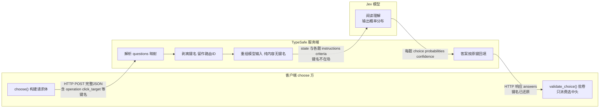
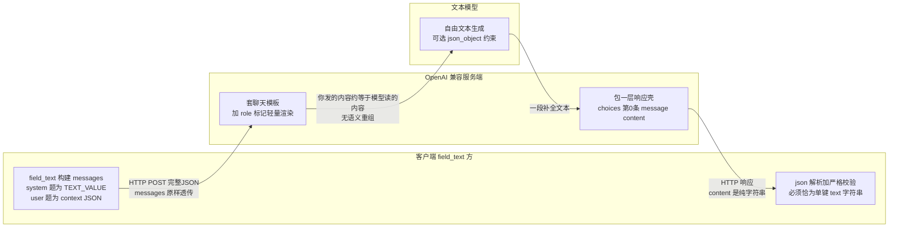

# TypeSafe 协议交互详解 — Agent 与 Jev 模型的通信契约

> 本文整理自对 [3-TypeSafe请求构建与发送.md](./step内部流程/1-预测决策内部逻辑/3-TypeSafe请求构建与发送.md) 的延伸讨论，
> 覆盖四个问题：**协议是什么性质的**、**一次真实的请求/响应长什么样**、**哪些字段固定哪些动态**、**模型如何把内容和问题关联起来**。
> 源码依据：`jev_ultrafast/model.py`、`questions.py`；协议依据：[TypeSafe API 文档](https://docs.typesafe.ai/api)。

---

## 1. 📡 协议性质：专有的 systemone API

Agent 与 Jev 决策模型的交互跑在 **TypeSafe 的专有协议**上，不是行业开放标准：

```text
POST https://api.typesafe.ai/v1/systemone        ← URL 级版本号 /v1
Authorization: Bearer <TYPESAFE_API_KEY>
Content-Type: application/json
```

### 1.1 协议定义的能力

| 协议要素 | 内容 |
|------|---------|
| 请求三顶层字段 | `state`（被评估的内容，任意结构）+ `model`（模型名，如 `jev-latest`）+ `questions`（问题映射） |
| 问题类型（3 种） | **Noul**（布尔，返回 0–1 概率）、**Choice**（≤255 选项，criteria 为"选项→说明"的 map）、**Score**（2–10 级评分尺） |
| Choice 答案契约 | `choice` + **覆盖全部候选、和为 1 的 `probabilities`** + `confidence`（由分布推导） |
| 多问题语义 | 一次请求携带任意多个问题**并行回答**——问题键由调用方自定义，**键名不发给模型**，答案按原键返回 |
| 错误语义 | 401（Key 无效）/ 422（校验失败）/ 429、529（限流/过载，建议指数退避） |

### 1.2 本项目的用法与双轨对比

- 项目**只用 Choice 类型**（`model.py:92,95`）；operation 头与各目标头都是 Choice。
- 一次多问题的并行问答即 [TypeSafe speculative fan-out](https://docs.typesafe.ai/patterns/fan-out) 模式。
- 与文本模型（`field_text`）构成刻意的双轨：

| | 决策（Jev） | 文本（field_text） |
|---|---|---|
| 协议 | TypeSafe systemone（**专有**） | OpenAI Chat Completions（**事实标准**） |
| 换供应商 | 必须改代码（URL/信封都不同） | 只改 `.env` 三个变量 |
| 回答形态 | 结构化选择 + 概率分布 | 自由文本（靠 `response_format: json_object` 约束） |
| 模型可换性 | 协议内换版本（`jev-latest` → 实际 `jev-1.13.0`） | 任意 OpenAI 兼容服务商 |

**一句话**：Agent 与 Jev 的交互 = 固定的专有协议 + 动态的载荷 + 协议内可替换的模型参数。决策层要的是带校验的结构化输出，接受专有性；文本生成是通用能力，走开放标准保持供应商中立。

---

## 2. 🧠 直觉模型：一张考卷

一次请求 = 发给模型一张**三道题的考卷**，要求一次性全部作答：

- **第 1 题（operation）**："下一步该做哪种操作？"——选项：CLICK / TYPE_TEXT / SCROLL_DOWN / WAIT / DONE / BLOCKED
- **第 2 题（click_target）**："*如果*操作是 CLICK，该点哪个元素？"——选项：只有可点击的元素
- **第 3 题（type_text_target）**："*如果*操作是 TYPE_TEXT，该填哪个字段？"——选项：只有可输入的字段

模型交卷后，代码**只批第 1 题**，按其答案决定批哪道目标题——另一道直接扔掉（投机头）。

| 请求体字段 | 考卷上的角色 | 模型是否看到 |
|-----------|-------------|-------------|
| `questions` 的键名（operation / click_target） | **题号**——答题卡回填用 | ❌ 不进入模型输入（见下方注） |
| `instructions`（goal + rules + operation 假设） | **题干** | ✅ |
| `criteria` | **选项 + 释义** | ✅ |
| `state` | **所有题共享的阅读材料** | ✅ |

> **注：键名的三层命运**。① **线缆层**：键名确实随 HTTP 请求体发送到了 TypeSafe 服务器——它就是 JSON 的字段名；② **服务端**：服务器解析 questions 映射后，用键名做答案路由 ID，并在**构造模型输入时把键剥离**（官方文档的原话是 "keys aren't sent to the model"，指的正是这一步）；③ **模型层**：Jev 的上下文里只有 state 与每道题的 instructions/criteria，**键名从未出现在模型眼前**——不是"模型收到后丢弃"，而是根本没进模型的输入。
>
> 这个区别有实质意义：既然键名在机制上进不了模型上下文，它就**不可能影响模型输出**——问题可以随意命名，不必担心命名本身成为提示注入的载体；键的唯一用途是服务端把答案按原键放回 `answers`，供代码取回。

### 2.1 一次交互的数据变换全景图

**核心事实：客户端发出的内容不是原样给模型的。** TypeSafe 服务端在中间做了一次"剥离—重构—还原"：去程把键名剥掉、只把内容重组成模型输入；回程把答案按原键名还原。



同一份数据在三个检查点的形态对照：

```text
检查点 ① 线缆上的请求体              检查点 ② 模型的输入               检查点 ③ 回到客户端的响应
（客户端 → 服务端）                   （服务端重组后）                  （服务端 → 客户端）
┌────────────────────────┐     ┌────────────────────────┐     ┌────────────────────────┐
│ {                      │     │ state:                 │     │ { "answers": {         │
│   "model": "jev-latest"│     │   page / elements /    │     │   "operation": {       │
│   "state": {...},      │     │   recent_actions       │     │     choice, probs,     │
│   "questions": {       │ ──▶ │ 题 #1: instructions    │ ──▶ │     confidence },      │
│     "operation": {...},│ 剥键 │        + criteria      │ 还原 │   "click_target": {...}│
│     "click_target": {} │     │ 题 #2: instructions    │ 键名 │   },                  │
│   }                    │     │        + criteria      │     │   ... },              │
│ }                      │     │ （键名不在场）           │     │   "model": "jev-..." } │
└────────────────────────┘     └────────────────────────┘     └────────────────────────┘
        ▲                              ▲                              ▲
   你在抓包里能看到的            只有 Jev 看到的                  键名"复活"仅供
   全部内容                     部分（服务端内部表示）             model.py:127 拼键取答案
```

三个检查点的分工一句话：**① 有键名，是为了路由；② 无键名，模型只见内容；③ 键名还原，代码按图索骥。** 客户端对 ② 完全不可见、也不需要关心——它只需要信任契约：答案与键无关地"照题作答"，再被准确地送回自己命名的键下。

### 2.2 对照：OpenAI 式交互的数据变换（本项目文本轨的实测路径）

以本项目 `field_text()`（model.py:160-198）走的 OpenAI Chat Completions 为例——它和 2.1 是**同一个项目、同一个 `post_json` 传输层**，只有协议不同，是最佳对照组：



三个检查点的形态对照（与 2.1 并排看）：

```text
检查点 ① 线缆上的请求体                检查点 ② 模型的输入                检查点 ③ 回到客户端的响应
┌──────────────────────────┐     ┌────────────────────────┐     ┌────────────────────────┐
│ {                        │     │ [system] TEXT_VALUE... │     │ { "choices": [{        │
│   "model": "glm-5.3",    │     │ [user] {"goal":...,    │     │   "message": {         │
│   "messages": [          │ ──▶ │         "field":...,   │ ──▶ │     "content":        │
│     {system: TEXT_VALUE},│ 透传│         "page":...}    │ 包装 │       '{"text":       │
│     {user: context JSON} │     │ （≈ 你发送的内容，       │     │         "Zurich"}'    │
│   ],                     │     │   仅加 role 标记）      │     │   } }], "usage": ...} │
│   "response_format":     │     │                        │     │ （content 是字符串，    │
│     {type: json_object}  │     │                        │     │  JSON 要客户端自己解析）│
│ }                        │     │                        │     │                        │
└──────────────────────────┘     └────────────────────────┘     └────────────────────────┘
```

**与 2.1 最大的形态差异**：OpenAI 协议里你发的 messages 几乎就是模型的上下文（"所见即所发"），服务端只做 role 模板渲染等薄封装；而 systemone 的请求体是"给服务器的申请书"，模型输入是服务器重组后的"考卷"，两者不是同一份东西。

### 2.3 两张图的逐点对比

| 维度 | systemone（决策轨，2.1） | OpenAI Chat Completions（文本轨，2.2） |
|---|---|---|
| 请求体与模型输入的关系 | **不同**——服务端剥键名、重组考卷 | **基本相同**——messages 就是模型上下文 |
| 服务端角色 | "翻译关"：剥离 / 重组 / 还原 | 薄封装：套 role 模板、包响应壳 |
| 键名/路由 | 多问题靠键名路由，键名不进模型 | 无多问题概念，一问一答 |
| **结构化从哪来** | **协议内建**：choice + criteria + 概率分布（和为 1 是契约） | **客户端外挂**：response_format 约束 + 自己解析校验 |
| 输出形态 | 结构化答案对象 | 自由文本字符串 |
| 失败模式 | 投机头畸形无害；被选头被 validate_choice 拦截 | 思考前缀 / 多键 / 非字符串 → `ValueError("...nothing typed")` |
| 模型侧自由度 | 只能在给定选项中分配概率 | 任意生成，靠事后校验收口 |

**本质差异一句话**：systemone 把"结构"放在**协议里**（服务端保证答案可校验），OpenAI 把"结构"留给**客户端**（发出去的是提示，收回来的是文本，对错自己把关）。这也解释了为什么 `choose()` 的校验是防御性复核（协议本应保证），而 `field_text()` 的校验是必要的收口（协议根本不保证）。

---

## 3. 🧪 完整请求/响应示例（Flights 首页第一次决策）

**场景**：页面刚加载，快照发现 4 个元素——票型切换按钮、出发/到达 combobox、日期框。注意每个可编辑 combobox 有**两个**动作（fill + click），共享同一索引。

### 3.1 请求体

```json
POST https://api.typesafe.ai/v1/systemone
Authorization: Bearer <TYPESAFE_API_KEY>

{
  "model": "jev-latest",
  "state": {
    "page": {
      "url": "https://www.google.com/travel/flights?hl=en",
      "title": "Find Cheap Flights Worldwide & Book Your Ticket - Google Flights",
      "text": "Round trip. 1 Adult. Economy. Where from? Where to? Departure. Search. …(≤6000 字符可见文本)"
    },
    "elements": [
      { "index": "1", "label": "Change ticket type. Round trip", "role": "button",   "value": "", "operations": ["CLICK"] },
      { "index": "2", "label": "Where from?", "role": "combobox", "value": "", "operations": ["TYPE_TEXT", "CLICK"] },
      { "index": "3", "label": "Where to?",   "role": "combobox", "value": "", "operations": ["TYPE_TEXT", "CLICK"] },
      { "index": "4", "label": "Departure",   "role": "textbox",  "value": "", "operations": ["CLICK"] }
    ],
    "recent_actions": []
  },
  "questions": {
    "operation": {
      "type": "choice",
      "criteria": {
        "CLICK":       "Click an element, button, menu option, autocomplete suggestion, or calendar day.",
        "TYPE_TEXT":   "Enter or replace text in an editable field. A small LLM will supply the value from the goal.",
        "SCROLL_DOWN": "Scroll down",
        "WAIT":        "Wait for the page to update",
        "DONE":        "Every requirement is visibly satisfied.",
        "BLOCKED":     "No supported operation can progress."
      },
      "instructions": {
        "goal": "Find one-way flights from Zurich to London on October 20, 2026, …",
        "rules": "<NEXT_ACTION 全文，questions.py:3-14>"
      }
    },
    "click_target": {
      "type": "choice",
      "criteria": {
        "1": { "element": "[1] Change ticket type. Round trip", "current_value": "", "role": "button" },
        "2": { "element": "[2] Open Where from?", "current_value": "", "role": "combobox" },
        "3": { "element": "[3] Open Where to?",   "current_value": "", "role": "combobox" },
        "4": { "element": "[4] Open Departure",   "current_value": "", "role": "textbox" }
      },
      "instructions": { "goal": "…同上…", "operation": "CLICK", "rules": ["<NEXT_ACTION>", "<TARGET 全文，questions.py:16-19>"] }
    },
    "type_text_target": {
      "type": "choice",
      "criteria": {
        "2": { "element": "[2] Where from?", "current_value": "", "role": "combobox" },
        "3": { "element": "[3] Where to?",   "current_value": "", "role": "combobox" }
      },
      "instructions": { "goal": "…同上…", "operation": "TYPE_TEXT", "rules": ["<NEXT_ACTION>", "<TARGET>"] }
    }
  }
}
```

看点：
- 同一 combobox 在两道目标题里**共享索引**但面貌不同：click_target 里是 "Open Where from?"（点开），type_text_target 里是 "Where from?"（填字）。
- WAIT/SCROLL/DONE/BLOCKED 不可寻址，只出现在 operation 题。
- 若页面有原生 `<select>`，会多一个 `select_target` 头，目标键为复合索引 `"5:2"`（元素 5 的第 2 个选项）。

### 3.2 响应体

```json
{
  "model": "jev-1.13.0",
  "answers": {
    "operation": {
      "choice": "CLICK", "confidence": 0.92,
      "probabilities": { "CLICK": 0.94, "TYPE_TEXT": 0.04, "WAIT": 0.01, "SCROLL_DOWN": 0.0, "DONE": 0.0, "BLOCKED": 0.01 }
    },
    "click_target": {
      "choice": "1", "confidence": 0.90,
      "probabilities": { "1": 0.90, "2": 0.04, "3": 0.03, "4": 0.03 }
    },
    "type_text_target": {
      "choice": "3", "confidence": 0.55,
      "probabilities": { "2": 0.75, "3": 0.45 }
    }
  },
  "usage": { "input_tokens": 1830, "output_tokens": 96 }
}
```

⚠️ `type_text_target` 的概率和是 0.75+0.45=**1.2** ≠ 1——**故意示例**：投机头即使返回畸形答案也无害，因为本次操作选了 CLICK，代码只校验 `click_target`（`model.py:127` 只读取 `operation.lower() + "_target"`）。

### 3.3 校验与翻译（model.py:120-133）

```text
① 批 operation 题（候选 = criteria 的 6 个键）
   choice∈候选 ✓  概率覆盖全集 ✓  均为[0,1] ✓  和≈1 ✓  CLICK 是最大值(0.94) ✓
② operation=CLICK 是可寻址操作 → 批 click_target 题（候选 = "1"~"4"）→ 全过 → target="1"
③ 翻译：targets["CLICK"]["1"] 背后的真实动作是快照里的 e1
   （快照按 DOM 顺序编号：e1=票型按钮 click，e2=Where from 的 fill，e3=Open Where from 的 click…）
④ 概率的键从目标索引换成动作 id
```

最终 `state['decision']`：

```json
{
  "choice": "e1", "operation": "CLICK", "target": "1",
  "confidence": 0.92, "target_confidence": 0.90,
  "probabilities": { "e1": 0.90, "e3": 0.04, "e5": 0.03, "e6": 0.03 },
  "operation_probabilities": { "CLICK": 0.94, "…": "…" },
  "target_probabilities": { "1": 0.90, "2": 0.04, "3": 0.03, "4": 0.03 },
  "model": "jev-1.13.0", "latency_ms": 178,
  "usage": { "input_tokens": 1830, "output_tokens": 96 },
  "raw_answers": { "…": "响应原文，供审计" },
  "request": { "…": "请求原文，供审计" }
}
```

执行层随后拿 `choice: "e1"` 去 `page["actions"]` 查回动作对象并执行——整条链路里模型只说过一句话：**"CLICK，1 号"**。

---

## 4. 🔒 字段固定性分析（三层）

### 4.1 代码级常量（硬编码，任何运行不变）

| 字段 | 值 | 出处 |
|------|-----|------|
| 所有问题的 `"type"` | `"choice"` | `model.py:92,95` |
| 操作说明文案（4 条） | CLICK / TYPE_TEXT / SELECT 描述 | `model.py:84-87` |
| DONE / BLOCKED 文案 | 固定英文句 | `model.py:90` |
| `rules` 规则全文 | NEXT_ACTION、TARGET | `questions.py:3-19` |
| 目标头 `instructions.operation` | 各头固定字面量 | `model.py:105` |
| 控制动作 label | "Wait for the page to update" 等 | `snapshot.js:102-104` |
| 结构性键名 | state/page/elements/recent_actions/questions/criteria/instructions | `model.py:107-117` |

### 4.2 运行级常量（一次任务内不变，跨任务可变）

| 字段 | 说明 |
|------|------|
| `model` | `TYPESAFE_MODEL` 环境变量或默认 `jev-latest` |
| `instructions.goal` | 用户目标；**每个问题的 instructions 里都重复同一个 goal** |

### 4.3 逐请求动态（每次决策重建）

| 字段 | 为什么变 |
|------|---------|
| `state.page.url/title/text` | 最新快照 |
| `state.elements` | 当前页动作重建；**索引编号随页面重排** |
| `state.recent_actions` | 最近 10 条历史摘要 |
| 各问题 `criteria` 的键和值 | 候选集 = 当前页面有什么；`current_value` 随填写进度变化 |
| **目标头的存在性** | 没有可选元素就没有对应头（`model.py:94` 只为非空操作建头） |
| 控制动作存在性 | scroll_up/down 依滚动位置；WAIT/DONE/BLOCKED 恒在 |

### 4.4 响应侧的固定契约

| 层面 | 固定的 | 动态的 |
|------|--------|--------|
| 顶层 | 键名 `answers` / `model`；`usage`（可选） | 值全部动态 |
| 每个答案头 | 键名三件套 `choice` + `probabilities` + `confidence` | 三个值全动态 |
| `probabilities` 的键 | **必须与对应问题 criteria 键集合完全一致**（`validate_choice` 强制） | 键集合随请求走 |

`validate_choice`（`model.py:30-45`）对**被消费的头**强制五条：choice ∈ 候选、概率覆盖全集、均 ∈ [0,1] 且有限、总和 ≈ 1（±0.02）、被选项是最大值。任一不过 → ValueError，本次不执行任何动作。协议本身保证分布归一，客户端校验是防御性复核。

**总结**："问题怎么问"是固定的（考卷格式和规则全文不变），"问什么"是动态的（选项随页面重建），"怎么批卷"是固定的（五条校验 + 只批选中的头）。

---

## 5. 🔗 模型如何把 state 与 questions 关联起来

这是最容易误解的一点：**模型根本看不到 "operation" / "click_target" 这些键名**——键名虽随请求体发送到了服务器（见第 2 节注），但服务端构造模型输入时会将其剥离（协议规定 keys aren't sent to the model），它的用途只是让答案按原键路由回代码（`model.py:127` 靠 `operation.lower() + "_target"` 拼键取答案）。模型不是"理解了字段含义"，而是在**阅读自然语言**。

### 5.1 语义的三个载体

1. **`state`** —— 所有题目共享的"阅读材料"（页面文本、元素表、历史）。
2. **`instructions`** —— 题干：
   - operation 题的任务定义（NEXT_ACTION 第一句）：

     > *"Advance the user's entire goal from the **CURRENT page** using **one operation**."*

     "CURRENT page" 以自然语言指代完成与 state 的关联。
   - 目标题的任务定义（TARGET）：

     > *"Choose the best observed target **if the next operation is the one specified in this question**. ... **This question chooses only a target for that operation; another question decides which operation to execute.** Choose only an offered element index."*
3. **`criteria`** —— 选项自带释义（操作说明 / 元素描述）。

### 5.2 元素如何与 state 对上

靠**同一套人类可读标签**：state.elements 里有 `[2] Where from? · combobox`，click_target 选项里是 `[2] Open Where from?`——模型用阅读理解将两者对应，`[index]` 是消歧锚点。如同阅读理解题：材料提到某人，选项出现同一人名。

### 5.3 为什么题干要写"if"

`docs/design.md` 原话：

> "The questions run independently: a target cannot read the operation answer, so its premise explicitly names the operation it assumes."

各题**独立作答**，目标题看不到 operation 题的答案，所以 `instructions.operation: "CLICK"` 必须显式声明假设。这是投机多头模式能成立的语言学前提。

---

## 📊 速查总结

| 问题 | 答案 |
|------|------|
| 协议是什么 | TypeSafe 专有 systemone API（非开放标准）；HTTPS + Bearer；/v1 版本化 |
| 用了哪些协议能力 | 仅 Choice 类型；多问题并行（fan-out） |
| 模型看到什么 | state + instructions + criteria；**看不到问题键名** |
| 什么固定 | 信封（键名/类型/文案/规则）+ 批卷规则（validate_choice 五条） |
| 什么动态 | state 全部、criteria 键值、目标头存在性 |
| 语义在哪 | 题干措辞（questions.py 的 26 行提示词是真正的"策略层"） |
| 双轨设计 | 决策锁定 TypeSafe 换模型不改信封；文本走 OpenAI 兼容标准可随意换供应商 |
