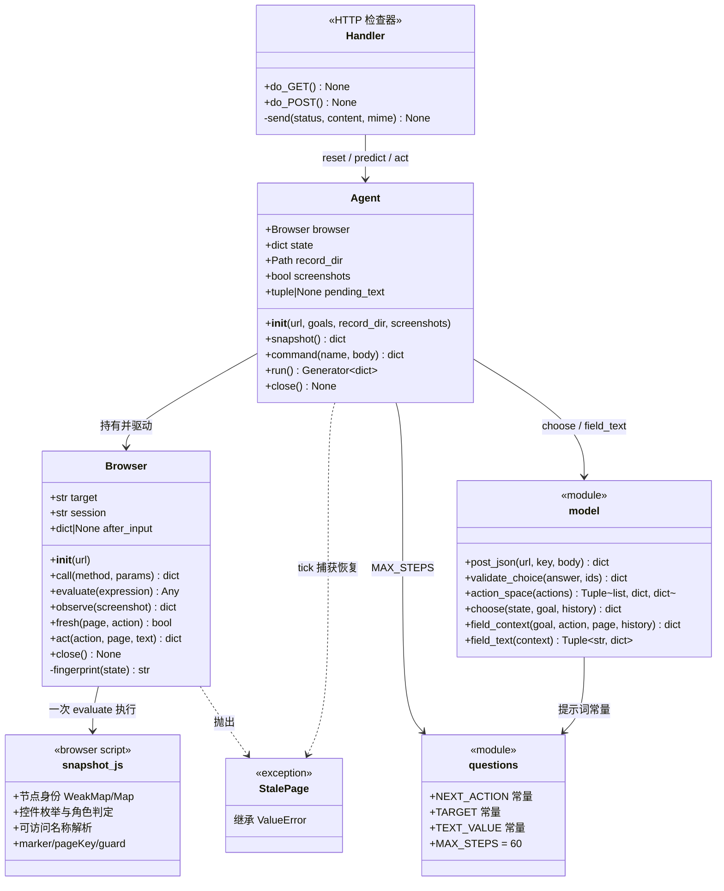
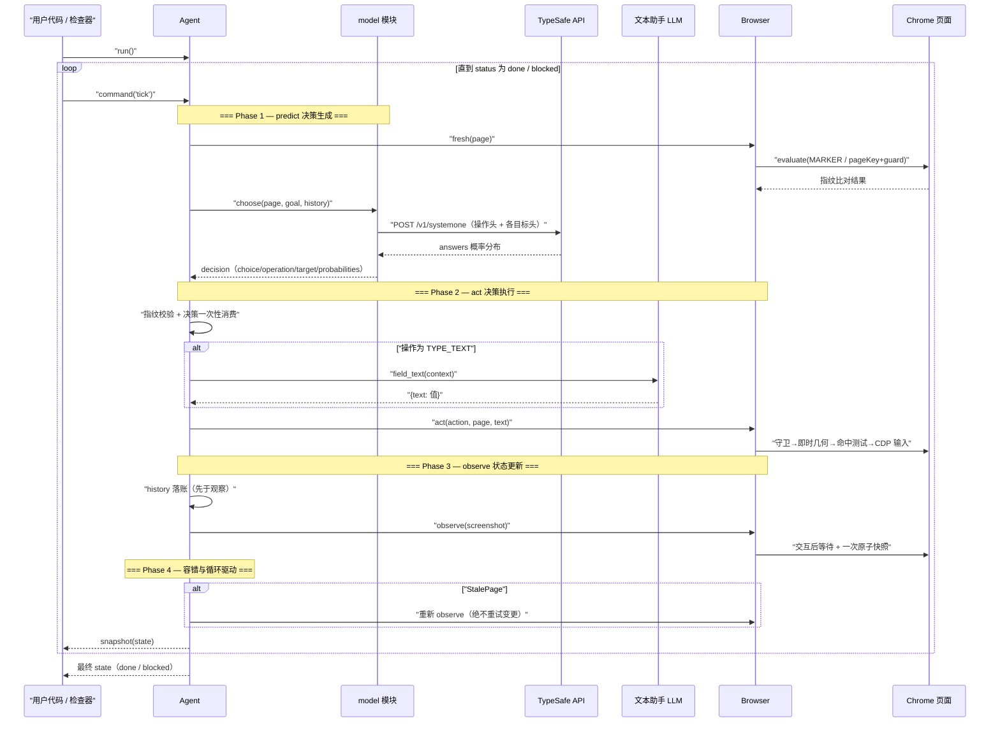
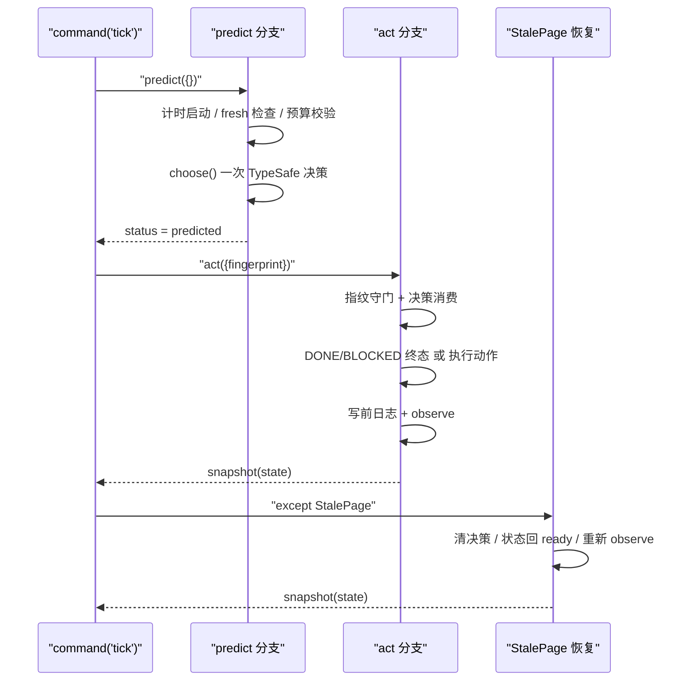
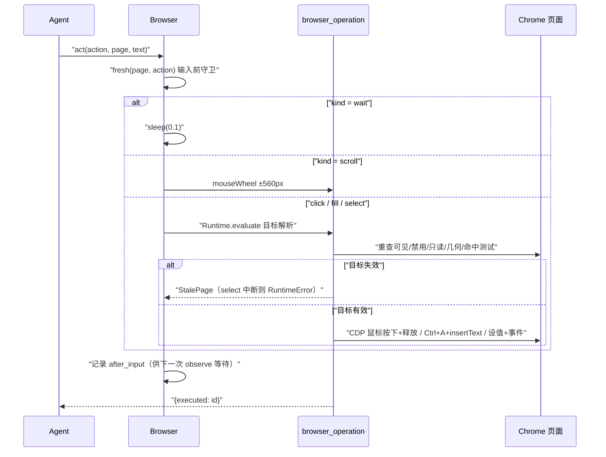
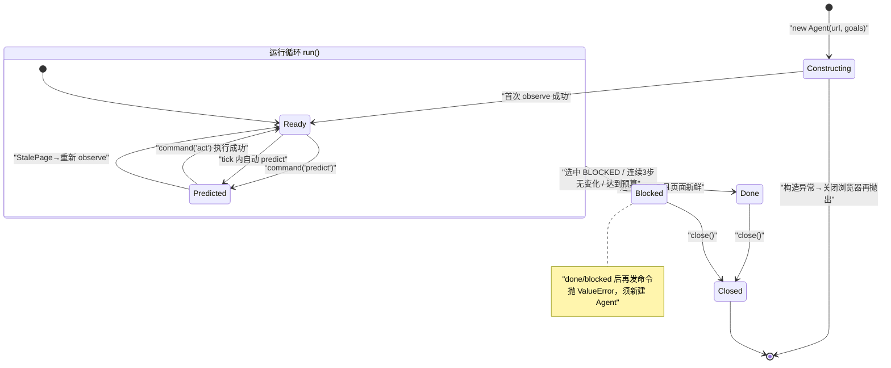
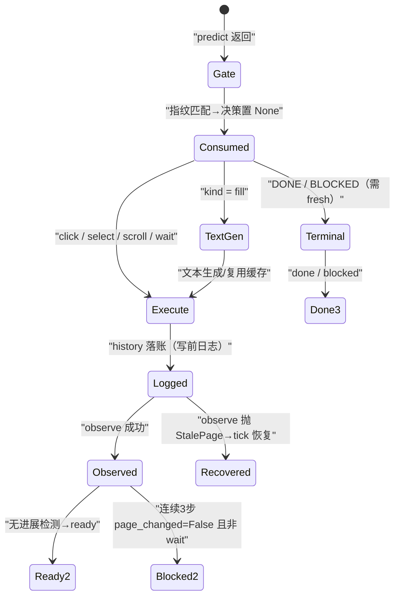
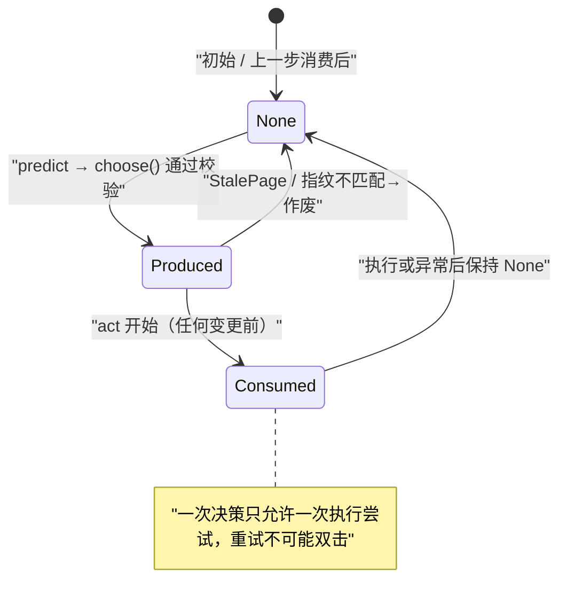

# Agent 运行逻辑分析 — Jev Ultrafast

> 源码入口: `jev_ultrafast/agent.py`（Agent 类，完整的 agent loop）
> 辅助模块: `browser.py`（观察/执行）、`model.py`（决策/文本）、`questions.py`（提示词）、`snapshot.js`（DOM 快照契约）、`demo.py`（本地检查器）

---

## 1. 架构总览

**一句话概括**：Jev Ultrafast 是一个"**选择而非生成**"的浏览器 Agent —— 主循环 `tick = predict + act` 中，TypeSafe Jev 模型从**每次观察动态构建的索引动作空间**里一次性选定"操作 + 该操作的目标"（投机性多头，一次网络往返），只有 `TYPE_TEXT` 操作才由小型文本 LLM 生成字段值；**代码（而非模型）拥有全部执行权**，模型输出永远只是有限候选的 id。

核心设计原则：

1. **循环极简**：`page → indexed elements → operation + target → execution`，无计划系统、无消息管理器、无工具注册表（AGENTS.md 明文约束）。
2. **一次请求定两件事**：操作头与各操作的目标头在同一 TypeSafe 请求中并行回答，只有被选中操作的目标头会被消费（Speculative Fan-out，`model.py:94-130`）。
3. **代码拥有执行权**：目标必须是观察到的元素 id（`snapshot.js` WeakMap 身份），输入前重新解析几何并做命中测试；模型永不产出选择器/坐标/代码（`browser.py:141-160`）。
4. **变更绝不重试**：决策一次性消费；浏览器 mutation 失败/中断不重试，只重新观察（`agent.py:90-91`、`browser.py:130-131,161-164`）。
5. **写前日志**：动作先入 history 再观察结果，导航中断观察也不丢动作（`agent.py:120-141`）。
6. **语义新鲜度代替 DOM 计数**：全页 `marker` 指纹 + 点击/选择的 `page_key`+`guards` 双层守卫，动画不触发重新预测（`snapshot.js:44-54`、`browser.py:88-98`）。
7. **预算硬上限**：60 个浏览器动作、120 次决策请求、250 个动作候选、6000 字符可见文本（`questions.py:26`、`agent.py:75-76`、`snapshot.js:99-104,92`）。

---

## 2. 类图



> 类图说明：`model`、`questions`、`snapshot_js` 是模块级函数/浏览器脚本（非类），图中以 `<<module>>`/`<<browser script>>` 刻意标注。调用层级最深链为 `Handler → Agent → model → questions`（3 层），符合层级约束；每个成员的逐方法职责见 `类的职责/` 目录。

---

## 3. 核心运行流程 — 时序图

### 3.1 `Agent.run()` 主循环时序图



### 3.2 单步执行 (`command('tick')`) 内部流程



### 3.3 动作执行流程（`Browser.act` → `browser_operation`）



---

## 4. 状态图

### 4.1 Agent 生命周期状态图



### 4.2 单步内状态转换（tick 展开）



### 4.3 决策消费状态机（Plan 系统的等价物）

本项目没有计划系统；`state["decision"]` 的消费语义即等价物：



---

## 5. 关键子系统详解

### 5.1 LLM 交互层（决策 + 文本，两套模型）

> 协议细节、完整请求/响应实例与字段固定性分析见 [TypeSafe协议交互详解.md](./TypeSafe协议交互详解.md)。

- **TypeSafe Jev（决策）**：`model.choose()`（L81-148）把页面状态（url/title/可见文本 6000 字符/元素表/最近 10 条动作）与多个 choice 型问题（operation + `<op>_target` 头）打包为一次 `POST https://api.typesafe.ai/v1/systemone`；`post_json`（L15-27）对 429/529/503 指数退避重试 3 次（0.5s→1s→2s），其余错误立即抛 RuntimeError，**不带副作用**。
- **文本助手（生成）**：`model.field_text()`（L160-198）仅在 `TYPE_TEXT` 时调用，OpenAI 兼容 `/chat/completions`，强制 `response_format=json_object`，输出必须恰为 `{"text": str}` 且非空 ≤2000 字符；缺 `TEXT_MODEL_API_KEY` 直接抛错，代码绝不猜值。
- **响应校验**：`validate_choice`（L30-45）要求 choice ∈ 候选、概率覆盖全集、均为有限 [0,1]、总和≈1、被选项为最大值；**只校验被选中操作对应的目标头**——投机头的无效答案不可能变成动作。

### 5.2 观察层（一次原子读取）

- `snapshot.js` 在单次 `Runtime.evaluate` 中完成：节点身份分配（`window.__jevFast` WeakMap/Map，L3-8）→ 可见控件枚举（15 种 ARIA role + 原生元素，L24-81）→ 可访问名称解析（labelledby→aria-label→label→value→alt→文本→title→placeholder，L12-23）→ 可见文本截取（TreeWalker，≤6000 字符，L82-92）→ 新鲜度材料（marker/pageKey/guard，L44-54）→ 动作上限 250 + 追加 scroll/wait（L99-104）。
- `Browser.observe()`（browser.py L44-86）：先处理 `after_input` 交互后等待（combobox 等 `role=option` 可见最多 200ms；其余 2 个 rAF 或 50ms，L45-76）；随后单次调用快照，StalePage 最多重试 10 次（20ms 间隔）。测试 `test_observation_is_one_atomic_browser_read` 断言 `cdp.call_count == 1`。
- 优化前后中位浏览器协议调用 **1,092 → 101**（docs/performance.md），即源于此设计。

### 5.3 动作执行层

- `Browser.act()`（L100-107）：执行前 `fresh(page, action)`；wait 睡 100ms；scroll 用 `Input.dispatchMouseEvent(mouseWheel)`；click/select/fill 先在页面内重解目标（可见/禁用/只读/几何在视口内/`elementFromPoint` 命中，browser.py L144-160），click 走 CDP 鼠标事件，fill 用 Cmd/Ctrl+A（平台自适应）+ `Input.insertText`，select 直接设值并派发 input/change 事件。
- 中断的 select 抛 RuntimeError 而非 StalePage——change 事件可能已触发，重试有风险（L130-131,161-164；测试 `test_interrupted_dropdown_mutation_cannot_be_retried_as_stale`）。

### 5.4 新鲜度守卫与循环检测

- 双层守卫：一般操作比对全页 `marker`（URL/滚动/视口/标题/文本/动作语义）；click/select 额外比对 `page_key`（全部安全表单值）+ 目标 `guard`（目标属性 + 最近 form/dialog/row 作用域 6000 字符文本）（`snapshot.js:44-54`、`browser.py:88-98`）。
- 无进展检测：最近 3 条 history 均 `page_changed=False` 且 `kind != "wait"` → blocked（`agent.py:153-158`）；WAIT 动作豁免（测试 `test_loading_waits_do_not_trigger_no_progress_stop`）。
- 文本缓存复用条件：`pending_text` 仅当整个 `field_context` 完全相等时复用（`agent.py:109-115`；两条测试固定该语义）。

### 5.5 检查器（demo.py，非 TUI）

回环专用 HTTP 服务（127.0.0.1:8766）：Host/Origin/随机 Token 三重校验 + 非阻塞锁串行化（忙时 409）；`reset/predict/act` 命令直接映射 `Agent.command`；静态文件注入 Token。详见 `类的职责/demo检查器职责.md`。

---

## 6. 错误处理策略

| 异常类型 | 抛出点 | 处理方式 | 是否重试 |
|---------|--------|---------|---------|
| `StalePage`（ValueError 子类） | browser.py L41,131,164,190；agent.py 经 fresh 检查 | tick 捕获：清决策→回 ready→重新 observe（L57-64） | 只重观察，**绝不重试变更** |
| `RuntimeError` | model.py L20,25,27（模型连接/HTTP）；browser.py L131,163（select 中断） | 直接上抛，循环停止；检查器转 400/500，提示 Reset | post_json 内部对 429/529/503 退避 3 次 |
| `ValueError` | agent.py L66,74,76,89,104（状态/预算/指纹/未知命令）；model.py L44,163,193（校验失败/缺 Key/文本无效） | 上抛，无副作用（决策已消费但未执行任何浏览器变更） | 否 |
| `Exception`（观察失败 ×10） | browser.py L77-85 | 第 10 次仍失败才上抛 `StalePage("Page did not settle")` | 自动重试 10 次（20ms 间隔） |
| 构造期异常 | agent.py L22-26 | 关闭浏览器再抛出（不留孤儿标签页） | 否 |

终止条件：① `DONE`（页面仍新鲜）；② `BLOCKED`；③ 连续 3 步无进展；④ 60 动作预算；⑤ 120 决策预算；⑥ done/blocked 后再发命令报错。**`DONE` 不是成功证明**——examples/flights.py 用 `verify()` 独立校验最终页面（URL 路径、单程、城市、日期、结果可见）。

---

## 7. 初始化流程

```
Agent.__init__(url, goals, record_dir=None, screenshots=False)   (agent.py L13-44)
  ├── goals 规整：str → strip；list → join；空则 ValueError        (L14-16)
  ├── plan = [task]（单目标，plan_index 指向 0/1）                (L17)
  ├── self.pending_text = None（文本缓存）                         (L18)
  ├── Browser(url)                                                (L19)
  │     ├── ensure_daemon()（browser-harness 守护进程）            (browser.py L22)
  │     ├── Target.createTarget(background=True) → targetId       (L23)
  │     ├── Target.attachToTarget(flatten=True) → sessionId       (L24)
  │     ├── 视口 1120×780（setDeviceMetricsOverride）              (L25)
  │     ├── setFocusEmulationEnabled（后台标签页保渲染，不抢焦点） (L27)
  │     ├── Page.navigate(url)                                    (L28)
  │     └── 轮询 document.readyState ≤15s / 20ms 间隔             (L29-33)
  ├── screenshots = screenshots or bool(record_dir)               (L21)
  ├── try: page = browser.observe(screenshot)                     (L22-26)
  │     except: browser.close() 后再抛出
  ├── state = dict(browser/goal/page/decision/history/status=ready/
  │               plan/plan_index/decisions/text_calls/
  │               elapsed_ms=0/started_at=None/record)            (L27-41)
  └── record_dir 存在 → mkdir + 首屏写 000000.jpg                 (L42-44)
```

---

## 8. 控制流 — 暂停/恢复/停止

库层无 pause/resume API；暂停语义由**调用方控制迭代节奏**实现（生成器每 yield 一次即停一步）。检查器提供 "Choose next" 人工单步：

```
用户(检查器)                demo.Handler                 Agent
    │                          │                          │
    ├─ POST /api/reset ───────▶│ command('reset')         │
    │                          │  └─ 新建 Agent ──────────▶│ __init__ → 首次 observe
    ├─ POST /api/predict ─────▶│ command('predict') ─────▶│ choose → status=predicted
    │      （Choose next 模式：到此暂停，等待人工确认）      │
    ├─ POST /api/act ─────────▶│ command('act', fp) ─────▶│ 消费决策 → 执行 → observe
    │                          │                          │
    ├─ POST /api/tick ────────▶│ command('tick') ────────▶│ predict+act（自动模式）
    │                          │ LOCK 非阻塞获取失败→409   │
    │  终止：status ∈ {done, blocked} → 拒绝后续命令        │
    │  停止：Ctrl+C（demo.main KeyboardInterrupt→server_close，
    │         atexit close_browser 关标签页）               │
```

---

## 9. 关键数据流

```
用户目标 (自然语言)
     │
     ▼
┌────────────┐   一次 evaluate    ┌───────────────┐
│ Chrome 页面 │ ────────────────▶ │ snapshot.js   │
└────────────┘                   │ 节点身份+守卫   │
                                 └──────┬────────┘
                                        ▼
                              ┌──────────────────┐
                              │ page dict        │
                              │ url/text/actions │
                              │ fingerprint      │
                              │ marker/guards    │
                              └──────┬───────────┘
                                     ▼
                          ┌────────────────────┐
                          │ model.action_space │
                          │ 元素表+各操作目标头  │
                          └──────┬─────────────┘
                                 ▼  一次 POST（操作头+各目标头）
                          ┌────────────────────┐
                          │ TypeSafe answers   │
                          │ choice+概率分布     │
                          └──────┬─────────────┘
                                 ▼  校验（validate_choice）
                          ┌────────────────────┐   TYPE_TEXT 时
                          │ decision           │ ──────────▶ ┌────────────┐
                          │ choice=元素id       │             │ 文本助手    │
                          └──────┬─────────────┘             │ {text:值}  │
                                 ▼                           └─────┬──────┘
                          ┌────────────────────┐                  │
                          │ Browser.act        │ ◀────────────────┘
                          │ 守卫→几何→CDP 输入   │
                          └──────┬─────────────┘
                                 ▼
                          ┌────────────────────┐
                          │ history 落账        │ ← 写前日志（先于观察）
                          └──────┬─────────────┘
                                 ▼
                          ┌────────────────────┐
                          │ observe（新 page）   │ → 回到循环顶部
                          └────────────────────┘
```

---

## 📊 总结

| 维度 | 本项目做法 |
|------|-----------|
| Agent 模式 | Sense-Think-Act 单层循环（无 ReAct 文本推理、无 Plan-Execute、无多 Agent） |
| 决策方式 | TypeSafe 有限选择（分类式），投机多头一次往返 |
| 文本生成 | 独立小型 LLM，仅 TYPE_TEXT 触发，严格 JSON 校验 |
| 工具系统 | 无——动作空间即"工具"，随观察动态重建 |
| 安全边界 | 模型输出仅候选 id；输入前几何+命中重查；密码/文件字段不观察 |
| 容错 | 语义指纹守卫 + 决策一次性消费 + 变更零重试 + 写前日志 |
| 可观测 | history/decisions/text_calls 三账本 + 可选每步截图 |

> 子步骤级细节见 `step内部流程/`；类/模块职责见 `类的职责/`。
