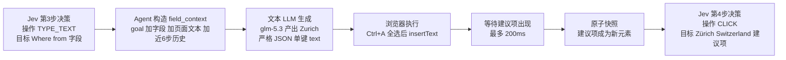

# 双模型联动机制 — Jev 决策模型与传统 LLM 的协作

> 本文回答一个问题：当遇到 Jev（纯选择题模型）无法独立完成的动作——填写文本框、上传文件、选择下拉列表——Agent 是怎么处理的？Jev 与传统 LLM 如何联动？
> 源码依据：`jev_ultrafast/agent.py`、`model.py`、`snapshot.js`、`questions.py`；实例取自一次真实的 Google Flights 运行 trace。
> 关联文档：[TypeSafe协议交互详解.md](./TypeSafe协议交互详解.md)（协议层）、[3-TYPE_TEXT文本生成与缓存.md](./step内部流程/2-执行决策内部逻辑/3-TYPE_TEXT文本生成与缓存.md)（执行层子步骤详解）。

---

## 1. 🗂️ 三类"无法处理的动作"，三种命运

Jev 是纯选择器——只能在给定选项里挑，不能生成内容。但"选不了"的问题有不同解法，**只有一种真正需要传统 LLM 参与**：

| 动作 | 处理方式 | 需要传统 LLM？ |
|------|---------|--------------|
| **下拉列表（原生 `<select>`）** | 把**每个未选中的选项**枚举成独立动作（`snapshot.js:68-71`），目标键为复合索引 `"5:2"`（5 号元素的第 2 项）。选下拉 = 仍然在做选择题，Jev 照样只挑选项 | ❌ |
| **文本框（TYPE_TEXT）** | Jev 只决定"**选哪个操作 + 在哪个字段**"（`model.py:86`），值由传统 LLM 生成（`model.py:160-198`）——**唯一真正的联动点** | ✅ |
| **上传文件 / 密码框 / 隐藏域** | `snapshot.js:9` 从源头过滤：`safe = e => !['password','file','hidden'].includes(e.type)`。它们**根本不进动作空间**，Jev 看不见、选不了——MVP 的显式边界（docs/design.md） | ❌ 不支持 |

下拉列表的解法值得单独品味：**不是让模型学会操作控件，而是把控件"摊平"成选项**。问题被消解在动作空间构造里，而不是模型能力里。这正是"动态动作空间"设计的巧妙之处——执行层的每一种交互形态，都尽量翻译成"选择题"呈现给模型。

---

## 2. 🔀 唯一的联动点：TYPE_TEXT 接力棒

联动现场在 `agent.py:105-118`。完整接力过程（节点标注为一次真实运行的步骤）：



逐步说明：

1. **Jev 选操作与字段**：predict 阶段，operation 头选中 TYPE_TEXT、type_text_target 头选中目标字段（一次请求完成）。
2. **Agent 构造上下文**：执行前先过 freshness（页面没变才生成，`agent.py:106-108`），然后组装 `field_context = {goal, field: {label, role, value}, page: {title, text[:6000]}, recent_actions[-6:]}`（`model.py:151-157`）——**整个 context 同时是缓存键**。
3. **LLM 生成值**：OpenAI 兼容接口，`response_format=json_object`，输出必须恰为 `{"text": 非空字符串 ≤2000}`，其余（思考前缀、多键、null、非字符串）一律拒绝——"nothing typed"（`model.py:187-193`）。
4. **浏览器执行**：Cmd/Ctrl+A 显式全选后 `Input.insertText`，替换既有内容（`browser.py:169-185`）。
5. **事件感知等待**：combobox 类字段等 `role=option` 的建议项可见，最多 200ms（`browser.py:45-76`）——建议先到，Jev 再选，省一轮无效预测。
6. **快照回流**：建议项作为新元素进入动作空间。
7. **Jev 再次决策**：下一轮 CLICK 选中匹配的建议项。

---

## 3. 🔍 分工细节

### 3.1 Jev 如何"知道"LLM 存在

只从说明文字知道。operation 头里 TYPE_TEXT 的候选描述（`model.py:86`）：

> *"Enter or replace text in an editable field. **A small LLM will supply the value from the goal.**"*

Jev 用自然语言被告知"你只管选字段，值有人写"。两个模型互相不知道对方的接口、供应商、甚至存在形式——协作语义完全由题干措辞承载。

### 3.2 两个模型从不直接对话

协调全靠 Agent 循环，观察结果是交接介质：

```text
Jev 的输出（TYPE_TEXT + 目标字段）
        │ 变成
        ▼
LLM 的输入（field_context 的 goal 与 field 部分）
        │ LLM 的输出（文本）输入浏览器
        ▼
下一轮快照的 recent_actions（含已填文本，model.py:112-113）
        │ 回流进
        ▼
Jev 的下一轮决策状态（它能看到"已经填过 Zurich"）
```

### 3.3 LLM 输出的隔离通道

LLM 的自由文本被严格隔离为**数据**：只经 `Input.insertText` 进入输入框，永远成不了选择器、坐标或可执行代码。对比两套安全模型：

| | Jev 侧 | LLM 侧 |
|---|---|---|
| 输出形态 | 结构化选择（候选 id + 概率） | 自由文本字符串 |
| 约束机制 | 协议内建 + validate_choice 五条校验 | 严格 JSON 契约（单键、非空、≤2000） |
| 失败处理 | 拒绝执行任何动作 | 拒绝输入任何字符 |
| 进入执行的方式 | 翻译成观察到的动作 id | 仅作为 insertText 的数据参数 |

### 3.4 缓存与边界

- `pending_text` 缓存仅在**整个 field_context 完全相等**时复用（`agent.py:109-114`）——stale 重试不重复花钱，页面一变立即作废；
- 成功输入后缓存清空（`agent.py:118`）——生成值永不跨字段复用；
- 缺 `TEXT_MODEL_API_KEY` 直接抛错，代码绝不硬编码或从目标里抽取引号字面量（测试 `test_quoted_task_text_still_uses_the_llm` 固定）。

---

## 4. 🥊 完整组合拳实例（真实 trace）

Google Flights 填城市是三种机制的串联（trace 实测）：

```text
第3步  Jev: TYPE_TEXT → Where from?        （Jev 选操作和字段）
       LLM:  "Zurich"                      （传统 LLM 生成值，glm-5.3，3.3s）
第4步  Jev: CLICK → Zürich, Switzerland    （建议项出现后，Jev 回来点选）
第5步  LLM:  "London"
第6步  Jev: CLICK → London, United Kingdom
```

为什么填完还要点一下？`questions.py` 的 NEXT_ACTION 规则明确写着：

> *"A typed query still needs its matching autocomplete suggestion selected."*

这是 ARIA combobox（输入框 + 弹出建议列表）的交互特性，规则文本把这条领域知识教给了 Jev——提示词即策略层。

---

## 📊 总结

| 问题 | 答案 |
|------|------|
| 下拉列表怎么处理 | 摊平成选项，仍是选择题，无需 LLM |
| 文本框怎么处理 | Jev 选"在哪填"，LLM 决定"填什么"，Agent 循环居中协调 |
| 上传/密码怎么处理 | 不进动作空间，显式不支持 |
| 两个模型怎么交流 | 从不直接对话；Jev 输出→LLM 输入，LLM 输出→浏览器→快照→Jev 下一轮状态 |
| Jev 怎么知道 LLM 存在 | operation 候选描述里的一句自然语言 |
| LLM 输出的安全边界 | 严格 JSON 单键契约，只作 insertText 的数据，永不成为代码/选择器 |
| 谁教 Jev"填完要选建议" | NEXT_ACTION 规则文本（提示词即策略层） |

**角色比喻**：Jev 是"手"（决定做什么、对谁做），传统 LLM 是"嘴"（说出填什么），Agent 循环是"脊髓"（在正确时机传导、校验、隔离两者）；下拉靠摊平选项消解，上传靠不进动作空间拒绝。
