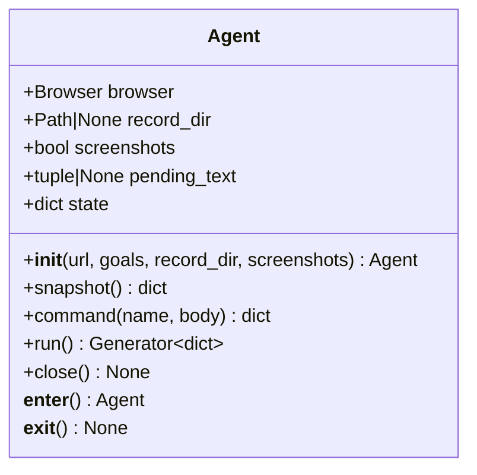

# `Agent` 类职责分析

> 源码位置: `jev_ultrafast/agent.py`（第 12-174 行，共 174 行文件）

---

## 📋 **类作用**

完整 agent loop 的唯一编排者：持有 Browser 与集中式 state，通过 `command()` 单方法状态机驱动「预测 → 执行 → 观察」循环，强制执行消费一次性、写前日志、文本缓存、预算与无进展检测等全部不变量。

---

## 🏗️ **类定义**



### 属性

| 属性 | 类型 | 访问 | 说明 |
|------|------|------|------|
| `browser` | `Browser` | public | 观察与执行的唯一通道；`fresh()` 判空作"是否已启动"信号 |
| `record_dir` | `Path|None` | public | 传入则每步落盘 JPG；隐含开启截图 |
| `screenshots` | `bool` | public | observe 是否附带 base64 截图（模型不消费，仅检查器/录制） |
| `pending_text` | `tuple|None` | public | `(context, text, helper)` 三元组——文本缓存 |
| `state` | `dict` | public | 集中式状态：goal/page/decision/history/status/decisions/text_calls/elapsed_ms/plan/plan_index/started_at/record |

### 方法

| 方法 | 参数 | 返回值 | 说明 |
|------|------|--------|------|
| `__init__` | `url: str, goals: str|list, record_dir=None, screenshots=False` | `Agent` | 目标规整、Browser 启动、首次观察、state 初始化 |
| `snapshot` | 无 | `dict` | state 去掉 browser + 追加 `elements` 索引表（对外只读视图） |
| `command` | `name: str, body=None` | `dict` | 单方法状态机：`tick`/`predict`/`act` 三分支，未知命令抛错 |
| `run` | 无 | `Generator[dict]` | `while status not in {done, blocked}: yield command("tick")` |
| `close` | 无 | `None` | 关闭浏览器标签页 |
| `__enter__`/`__exit__` | — | — | 上下文管理器保证 close |

---

## 🔍 **核心方法详解**

### `command('tick')`（第 55-64 行）

**作用**: 单步编排——预测 + 执行一体，并兜底 StalePage 恢复。

**逻辑流程：**
```
tick
  │
  ├── command('predict') → command('act', {fingerprint})
  │       │
  │       ▼ 成功 → 返回 snapshot
  └── except StalePage
        ├── state['decision'] = None（作废决策）
        ├── state['status'] = 'ready'
        ├── state['page'] = browser.observe(...)（重新观察）
        └── 更新 elapsed_ms → 返回 snapshot
```

**设计要点：**
- 恢复路径**不重试任何浏览器变更**，只重新观察后交给下一轮 predict。
- 测试 `test_navigation_during_prediction_reobserves_without_action` 固定：恢复后 `act` 从未被调用。

---

### `command('predict')`（第 65-85 行）

**作用**: 产出一次经过校验的模型决策。

**逻辑流程：**
```
predict
  ├── browser 判空 → ValueError("Start a demo first")
  ├── started_at 首次启动（elapsed_ms 计时零点）
  ├── browser.fresh(page) 不通过 → 先重新 observe        (L70-71)
  ├── state['decision'] = None（清旧决策）
  ├── status ∈ {done, blocked} → ValueError（终态拒绝）   (L73-74)
  ├── len(decisions) >= 120 → ValueError（决策预算）       (L75-76)
  ├── decision = model.choose(page, goal, history)        (L77)
  └── decisions.append({**decision, fingerprint, elapsed_ms})
        → status = 'predicted'
```

**设计要点：**
- 预算双重：动作 60（act 内）+ 决策 120（predict 内）。
- 每条决策记录自带 fingerprint 与耗时，天然形成可审计账本。

---

### `command('act')`（第 86-158 行）

**作用**: 消费决策并执行——本类最长方法，不变量最密集处。

**逻辑流程：**
```
act
  ├── 守门：decision 存在 且 body.fingerprint == page.fingerprint (L87-89)
  ├── 消费即失效：state['decision'] = None（先于任何变更）      (L90-91)
  ├── selected ∈ {DONE, BLOCKED}
  │     ├── browser.fresh 不通过 → StalePage（须重新决策）      (L93-96)
  │     └── 置终态 done/blocked → 返回                          (L97-100)
  ├── action = page.actions 中 id == selected                    (L101)
  ├── history >= 60 → blocked + ValueError                       (L102-104)
  ├── kind == 'fill'（TYPE_TEXT）
  │     ├── fresh 不通过 → StalePage                            (L106-108)
  │     ├── context = model.field_context(...)                  (L109)
  │     ├── pending_text 且 context 完全相等 → 复用缓存          (L110-111)
  │     └── 否则 field_text(context) → 记入 text_calls           (L112-115)
  ├── browser.act(action, page, text)（内部再次 fresh）          (L116-117)
  ├── pending_text = None（成功后缓存作废）                      (L118)
  ├── history.append({step/action/kind/choice/概率/置信度/
  │     双模型延迟/usage/page_changed/url/双时刻戳})             (L120-141) ← 写前日志
  ├── page = browser.observe(...)（交互后等待在此触发）          (L142)
  ├── history[-1].update(page_changed/url/elapsed_ms)           (L144-148)
  ├── record → 写 {elapsed_ms:06d}.jpg                          (L149-152)
  └── 无进展检测：最近3条 page_changed=False 且 kind≠wait
        → blocked，否则 ready                                   (L153-158)
```

**关键代码：**
```python
# 消费即失效（L90-91）——AGENTS.md「Never retry a browser mutation」的实现
state["decision"] = None
# 写前日志（L120-121）——先记录，后观察
state["history"].append({...})
```

**设计要点：**
- 决策消费发生在**任何变更或模型调用之前**，从结构上杜绝双击。
- `page_changed=None` 占位后由观察结果回填——导航中断观察时该字段保持 None，但动作已入账。
- 文本缓存按**整个 context 相等**复用，页面文本一变即失效（两条测试分别固定正反两面）。

---

### `snapshot()`（第 46-50 行）与 `run()`（第 163-165 行）

**作用**: 对外只读视图 / 循环驱动。

- `snapshot()`：`{**state 去 browser, elements: action_space(page.actions)[0]}`——元素索引表按需重建，不污染内部状态。
- `run()`：生成器逐 tick yield，暂停语义由调用方控制迭代节奏实现。

---

## 🎨 **设计亮点**

1. **单方法状态机**：`command()` 用名称字符串分发三个分支，没有继承体系与回调注册——「小到可通读」的直接体现。
2. **不变量内聚**：消费一次性、写前日志、缓存失效、无进展检测全部集中在 act 分支，审查面集中。
3. **状态即账本**：history/decisions/text_calls 三个 append-only 列表构成完整运行时证据链，examples 直接落盘为 state.json。
4. **异常即控制流**：StalePage 只在 tick 兜底恢复，手动模式暴露给调用方决定。

---

## 🔗 **与其他类的协作**

```mermaid
graph LR
    demoHandler[demo.Handler] --> Agent
    Agent --> Browser : "observe / fresh / act"
    Agent --> model : "choose / field_context / field_text"
    Agent --> questions : MAX_STEPS
    Agent ..-> StalePage : "tick 捕获恢复"
```

| 协作类 | 关系 | 协作方式 |
|--------|------|---------|
| `Browser` | 组合 | 唯一 I/O 通道；fresh 检查在 predict/act/DONE 三处调用 |
| `model` 模块 | 依赖 | choose（决策）、field_context/field_text（文本） |
| `StalePage` | 捕获 | tick 分支恢复；act 内多处主动抛出 |
| `demo.Handler` | 被调用 | reset/predict/act 直接映射 command |

---

## 📊 **生命周期**

- **创建时机**: `Agent(url, goal)`（库）或检查器 `reset` 命令（demo.py L54-61）。
- **使用场景**: `run()` 自动循环 / `command` 手动单步（Choose next）/ 读取 `snapshot()`。
- **销毁时机**: 上下文管理器退出、显式 `close()`、进程退出（demo 层 atexit）。
