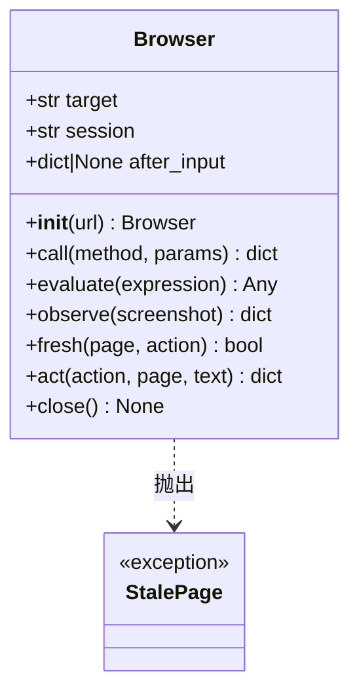

# `Browser` 类职责分析

> 源码位置: `jev_ultrafast/browser.py`（第 20-112 行为类，第 115-194 行为模块级函数）

---

## 📋 **类作用**

Agent 与 Chrome 之间的唯一通道：管理 CDP 会话生命周期（后台标签页、固定视口、焦点仿真），提供「原子观察 `observe` / 新鲜度判定 `fresh` / 受守卫的执行 `act`」三个原语；配套模块级 `fingerprint()` 与 `browser_operation()` 实现协议细节。

---

## 🏗️ **类定义**



### 属性

| 属性 | 类型 | 访问 | 说明 |
|------|------|------|------|
| `target` | `str` | public | CDP targetId；close 后置 None |
| `session` | `str` | public | flatten 模式 sessionId，所有 call 复用 |
| `after_input` | `dict|None` | public | 上一次非 wait 输入的动作，供下一次 observe 做针对性等待 |

### 方法

| 方法 | 参数 | 返回值 | 说明 |
|------|------|--------|------|
| `__init__` | `url: str` | `Browser` | 守护进程→建后台标签页→attach→视口 1120×780→焦点仿真→导航→等 readyState |
| `call` | `method, **params` | `dict` | 带 session 的 CDP 调用 |
| `evaluate` | `expression` | `Any` | Runtime.evaluate；exceptionDetails → StalePage |
| `observe` | `screenshot=True` | `dict` | 交互后等待 + 一次原子快照（StalePage 重试 ≤10） |
| `fresh` | `page, action=None` | `bool` | 双层守卫判定（见下） |
| `act` | `action, page, text=None` | `dict` | 输入前守卫 → 执行 → 记录 after_input |
| `close` | 无 | `None` | `Target.closeTarget` |

---

## 🔍 **核心方法详解**

### `__init__(url)`（第 21-33 行）

**作用**: 建立"owned 后台标签页"会话。

**逻辑流程：**
```
ensure_daemon()                     ← browser-harness 守护进程（L22）
  │
  ├── Target.createTarget(background=True, url="about:blank") → targetId (L23)
  ├── Target.attachToTarget(flatten=True) → sessionId              (L24)
  ├── setDeviceMetricsOverride(1120×780, dsf=1, mobile=False)     (L25)
  ├── setFocusEmulationEnabled(True)  ← 后台标签页 rAF 不被节流    (L27)
  ├── Page.navigate(url)                                           (L28)
  └── 轮询 document.readyState == complete（≤15s，20ms 间隔）       (L29-33)
```

**设计要点：**
- **焦点仿真**：隐藏标签页照常渲染动画/菜单，且不切换用户正在看的标签页。
- 标签页是 owned 的（close 必关），但共享现有 Chrome 配置文件（沿用登录态）。

---

### `observe(screenshot=True)`（第 44-86 行）

**作用**: 一次原子读取页面全部状态。

**逻辑流程：**
```
observe
  ├── after_input 存在？
  │     └── 是 → 页面内 Promise 等待（L49-74）：
  │           combobox fill → 等 role=option 可见，上限 200ms
  │           其他交互    → 2 个 rAF 或 50ms
  │           （只读；发生在执行已落账之后；导航打断它也无害 L75-76）
  └── 重试循环 ≤10 次（L77-85）
        └── browser_operation({observe, session, screenshot})
             抛 StalePage → sleep 0.02s 再试；第 10 次上抛
```

**关键代码：**
```python
# browser_operation 的 observe 分支（L188-194）
info = evaluate(READ_STATE)            # 整个 snapshot.js 一次执行
info["fingerprint"] = fingerprint(info)
if request.get("screenshot", True):
    info["screenshot"] = call("Page.captureScreenshot", format="jpeg", quality=72)["data"]
```

**设计要点：**
- **一次浏览器调用完成读取**（测试断言 `cdp.call_count == 1`）——协议调用 1,092→101 的来源。
- combobox 事件等待让自动补全建议先到，再让模型从完整弹层中选择。

**返回值结构**（snapshot.js 产出）：`url/title/w/h/text(≤6000)/scroll/actions(≤250+3)/marker/page_key/guards/omitted_actions` + `fingerprint` + 可选 `screenshot`。

---

### `fresh(page, action=None)`（第 88-98 行）

**作用**: 判定"决策仍指向观察时的页面"。

**逻辑流程：**
```
fresh
  ├── action 给出且 kind ∈ {click, select}
  │     ├── node 非整数 → False（非法引用）
  │     └── evaluate(pageKey(), guard(node)) == [page.page_key, page.guards[node]]
  └── 否则（fill/scroll/wait/DONE）
        └── evaluate(MARKER) == page.marker
```

**设计要点：**
- **双层守卫**：全页 marker（语义指纹）兜底；点击/选择再比对表单全量值 + 目标邻近上下文（form/dialog/row 作用域 6000 字符）。
- 只比语义不数 DOM 变更——动画/无关文本变化不触发重新预测（check_guards.py 全套回归覆盖）。

---

### `act(action, page, text=None)`（第 100-107 行）

**作用**: 执行前最后一道守卫 + 分发到 `browser_operation`。

**逻辑流程：**
```
act
  ├── fresh(page, action) 不通过 → StalePage("Observe again")   (L101-102)
  ├── kind == 'wait' → sleep(0.1)                               (L103-104)
  ├── browser_operation({act, session, action, text})           (L105)
  └── after_input = action（wait 除外）                          (L106)
```

`browser_operation` 的 act 分支（L135-186）：

```
kind=scroll → Input.dispatchMouseEvent(mouseWheel, 550,650, ±560)   (L138-139)
其余 → 页面内目标解析（L144-160）：
  ├── 节点 id 必须是代码所有整数（模型永不出选择器）L141-142
  ├── isConnected / :disabled / inert / checkVisibility 复查
  ├── fill 且 readOnly → null
  ├── 几何中心在视口内；elementFromPoint 命中元素自身（遮挡→null）
  ├── select：值必须在未禁用 option 中 → 设值 + input/change 事件
  └── 返回 {x, y}
target 为 None → select 抛 RuntimeError（中断不可重试），其余 StalePage (L161-164)
click → mousePressed + mouseReleased 于 (x, y)                    (L166-168)
fill  → Cmd(macOS)/Ctrl(其他) A + Input.insertText(text)          (L169-185)
返回 {"executed": action["id"]}
```

**设计要点：**
- 几何**总是在输入前重新解析**：动画移动的目标点当前位置，不重新预测。
- select 中断（evaluation context destroyed）抛 RuntimeError 而非 StalePage——change 事件可能已触发，重试有重复风险。

---

### `fingerprint(state)`（第 115-117 行）

sha256(json{url, text, actions, scroll})；截图不参与（测试 `test_fingerprint_tracks_values_and_identity_not_screenshots`）。

---

## 🎨 **设计亮点**

1. **原子观察**：观察=求值=一次调用，杜绝读撕裂。
2. **守卫分层**：语义 marker / 表单 page_key / 目标 guard / 输入前命中测试，四道闸各司其职。
3. **变更零重试**：act 无任何 try/except 重试路径；after_input 只影响下次观察的等待，不影响执行。
4. **平台自适应**：全选键 `modifiers = 4 if sys.platform == "darwin" else 2`。

---

## 🔗 **与其他类的协作**

```mermaid
graph LR
    Agent --> Browser : "observe / fresh / act"
    Browser --> snapshot_js[snapshot.js] : "evaluate(READ_STATE)"
    Browser --> harness[browser_harness.cdp] : "CDP WebSocket"
    Browser ..-> StalePage : "抛出"
```

| 协作方 | 关系 | 协作方式 |
|--------|------|---------|
| `Agent` | 被组合 | 三原语 + close |
| `snapshot.js` | 执行 | READ_STATE/MARKER 常量在模块加载时读入（L13-14） |
| `browser_harness` | 依赖 | ensure_daemon + cdp（一个守护进程、无每步子进程） |

---

## 📊 **生命周期**

- **创建时机**: `Agent.__init__` 内（构造失败由 Agent 负责关闭）。
- **使用场景**: 全部观察/守卫/执行均经此；examples 直接读 `agent.browser.target/session` 落盘。
- **销毁时机**: `close()` / `Target.closeTarget`；demo 层 atexit 兜底。
