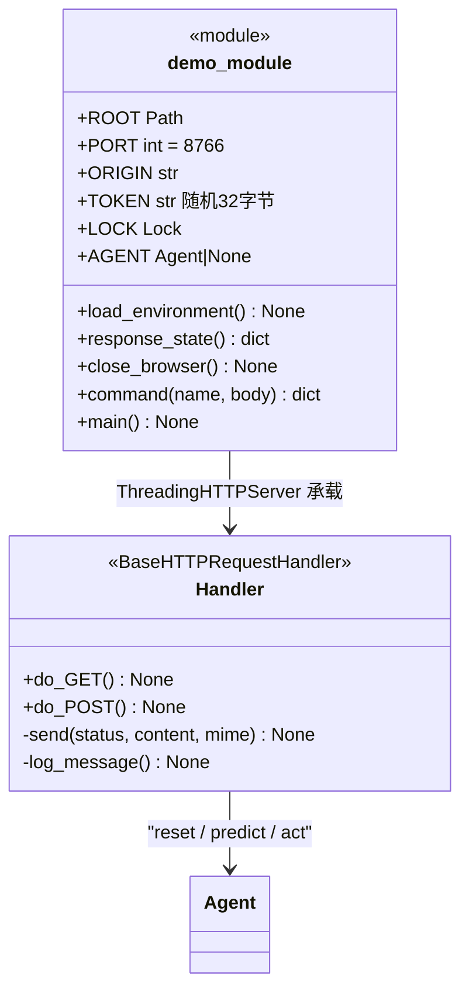

# `demo` 检查器职责分析

> 源码位置: `jev_ultrafast/demo.py`（第 1-145 行：模块函数 + `Handler` HTTP 类）+ `static/`（index.html / app.js / style.css / fixture.html）

---

## 📋 **作用**

`uv run jev` 启动的**回环专用本地检查器**：把 `Agent.command()` 的三个命令暴露为带安全校验的 HTTP API，并提供前端界面（编号元素、操作概率、目标概率、已执行动作、Choose next 单步）。是 Agent 之上的薄展示层，不含任何决策逻辑。

---

## 🏗️ **结构定义**



### 模块级状态

| 成员 | 说明 |
|------|------|
| `PORT` / `ORIGIN` | `TYPESAFE_DEMO_PORT` 可覆盖；恒为 `http://127.0.0.1:{PORT}` |
| `TOKEN` | `secrets.token_urlsafe(32)`，进程级一次性；注入静态 HTML 的 `__TOKEN__` 占位符 |
| `LOCK` | 非阻塞获取——串行化所有浏览器步骤 |
| `AGENT` | 全局单例；reset 时先 close 旧实例 |

---

## 🔍 **核心部分详解**

### 1️⃣ `load_environment()`（第 23-29 行）

读取 `cwd/.env`，`os.environ.setdefault`——**不覆盖已有环境变量**；仅 `含=且非#开头` 的行。

### 2️⃣ `command(name, body)`（第 44-67 行）

```
command
  ├── name == 'reset'
  │     ├── scenario ∈ {travel, research, flights} 白名单
  │     ├── goal 长度 1–2000 校验
  │     ├── close_browser()（旧实例）
  │     ├── AGENT = Agent(flights ? Google URL : 本地 fixture.html, goal,
  │     │                 screenshots=True, record_dir=可选)
  │     └── state['scenario'] = scenario
  └── 其余（predict/act/tick）
        └── AGENT 为 None → ValueError("Start a demo first")
          否则 AGENT.command(name, body) → 透传
  返回 response_state()（snapshot + text_model + max_steps）
```

**设计要点：** 本地 `fixture.html` 场景不花钱即可演示完整循环；flights 场景才触真实站点与付费 API。

### 3️⃣ `Handler` 安全模型（第 70-128 行）

```
do_GET：
  ├── Host != 127.0.0.1:PORT → 403（防 DNS rebinding）
  ├── /api/state → response_state（LOCK 保护读）
  ├── /demo.mp4 → docs 视频流
  └── 白名单静态文件（/, /app.js, /style.css, /fixture.html）
        → 读文本 + 替换 __TOKEN__ → 200（no-store + nosniff）

do_POST：
  ├── Host 校验 + X-Demo-Token == TOKEN + Origin ∈ {None, ORIGIN} → 否则 403
  ├── LOCK.acquire(blocking=False) 失败 → 409 "A browser step is already running"
  ├── 0 < Content-Length < 8192 → 否则 ValueError → 400
  ├── body = json.loads(...)；command(path 去掉 /api/, body)
  ├── ValueError/RuntimeError/TimeoutError → 400 {error}
  ├── 其余 Exception → 500 "no automatic retry. Reset to recover."
  └── finally LOCK.release()
```

**设计要点：** 错误响应明示**不自动重试**，与 Agent 的变更零重试不变量一致；token 注入使 CSRF 无法伪造步骤。

### 4️⃣ `main()`（第 131-141 行）

`load_environment → atexit.register(close_browser) → ThreadingHTTPServer(127.0.0.1) → 打印 URL → serve_forever`；KeyboardInterrupt → server_close。

---

## 🎨 **设计亮点**

1. **回环 + 三重身份校验**：Host/Origin/Token 全查——检查器能驱动真实浏览器与付费 API，故按"本地特权端点"标准设防。
2. **锁即语义**：非阻塞锁把"同一时刻只能有一个浏览器步骤"从注释变成 409 状态码。
3. **薄层原则**：所有分支只是参数校验 + 透传 Agent.command；Agent 不知检查器存在。

---

## 🔗 **与其他类的协作**

```mermaid
graph LR
    BrowserUI["浏览器前端 app.js"] --> Handler : "GET / POST + X-Demo-Token"
    Handler --> demoCmd[demo.command] : "reset / predict / act"
    demoCmd --> Agent : "构造 / command 透传"
    main --> Handler : 承载
```

| 协作方 | 关系 | 协作方式 |
|--------|------|---------|
| `Agent` | 持有 | 全局 AGENT 单例；reset 重建 |
| `static/app.js` | 被服务 | 轮询 /api/state 渲染；按 Choose next 决定何时 POST 下一步 |
| `atexit` | 兜底 | 进程退出关浏览器 |

---

## 📊 **生命周期**

- **创建时机**: `uv run jev`（pyproject 入口 `jev = jev_ultrafast.demo:main`）。
- **使用场景**: 人工演示/调试；smoke.py 依赖其 fixture.html 作为目标站点。
- **销毁时机**: Ctrl+C → server_close + atexit close_browser。
