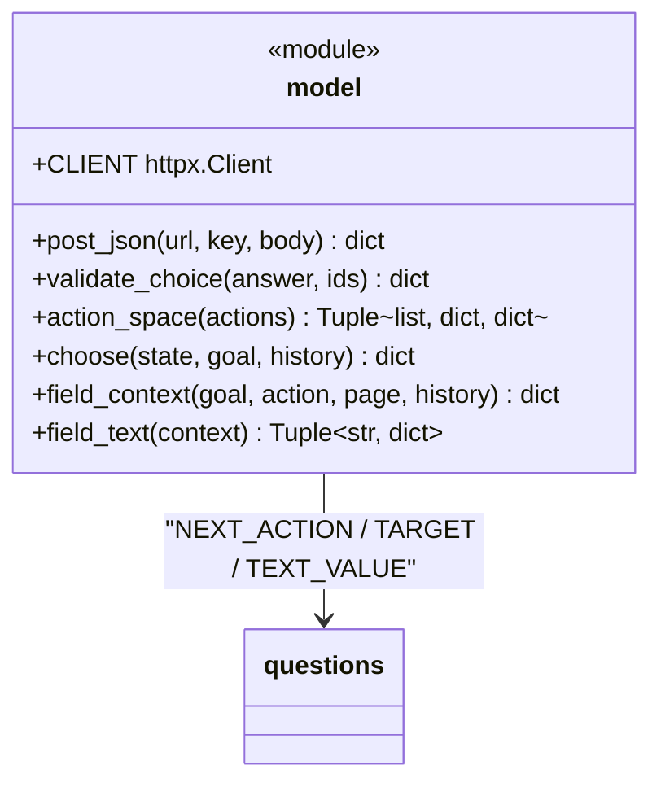

# `model` 决策模块职责分析

> 源码位置: `jev_ultrafast/model.py`（第 1-198 行，函数式模块，无类）

---

## 📋 **模块作用**

两套模型交互的纯函数层：`choose()` 把页面状态变成**一次** TypeSafe 多头请求并校验回收；`action_space()` 从观察动作构建动态索引空间；`field_text()` 在 TYPE_TEXT 时调用小型 LLM 严格生成字段值。无任何状态（仅模块级 `CLIENT` 连接池）。

---

## 🏗️ **模块定义**



### 函数

| 函数 | 参数 | 返回值 | 说明 |
|------|------|--------|------|
| `post_json` | `url, key, body` | `dict` | HTTP/2 POST；429/529/503 退避重试 3 次 |
| `validate_choice` | `answer, ids` | `dict` | choice 型答案的严格校验 |
| `action_space` | `actions: list` | `(elements, targets, controls)` | 动作空间：一节点一索引 + 各操作目标头 |
| `choose` | `state, goal, history` | `dict` | 一次 TypeSafe 决策（操作 + 目标） |
| `field_context` | `goal, action, page, history` | `dict` | 文本助手的完整输入（缓存键） |
| `field_text` | `context` | `(value, helper)` | 生成字段值 + 助手元数据 |

---

## 🔍 **核心函数详解**

### `action_space(actions)`（第 48-78 行）

**作用**: 把 snapshot 的扁平动作列表重组为「元素表 + 操作专属目标组 + 控制动作」。

**逻辑流程：**
```
对每个 action：
  ├── kind ∈ {click, fill, select} → 映射操作名 CLICK/TYPE_TEXT/SELECT
  │     ├── node 首次出现 → 分配 index = len(elements)+1
  │     │     └── 元素 = {index, label(去掉' → '后缀), role/value/checked/
  │     │                selected/expanded, operations:[], options:[](select)}
  │     ├── 操作加入该元素的 operations（同一元素可多操作）
  │     └── targets[operation][target] = action
  │           click/fill → target = index
  │           select     → target = "index:option序号"，options 逐条登记
  └── 其余（wait/scroll）→ controls[id 大写] = action
```

**返回值结构：**
| 字段 | 类型 | 说明 |
|------|------|------|
| `elements` | `list[dict]` | 索引元素表（发给模型与检查器） |
| `targets` | `dict[op, dict[target, action]]` | 每种操作各自合法的目标集合 |
| `controls` | `dict[str, action]` | WAIT/SCROLL_UP/SCROLL_DOWN |

**设计要点：** 一个 combobox 同时出现在 TYPE_TEXT 和 CLICK 头中且**索引相同**——测试 `test_one_index_per_node_with_operation_specific_targets` 固定。

---

### `choose(state, goal, history)`（第 81-148 行）

**作用**: 一次网络往返完成操作与目标两个决策。

**逻辑流程：**
```
choose
  ├── action_space(state.actions) → elements/targets/controls
  ├── 组装 operations 候选（带说明）：targets 非空的操作 + 控制动作 + DONE/BLOCKED
  ├── questions：
  │     ├── operation: {criteria: operations, instructions: goal + NEXT_ACTION}
  │     └── 每个操作 op 一个 op.lower()+'_target' 问题：
  │           criteria 仅含该操作候选（附元素串/current_value/role/checked/...）
  │           instructions: goal + 操作名 + [NEXT_ACTION, TARGET]
  ├── body = {model: TYPESAFE_MODEL|jev-latest,
  │           state: {page: url/title/text, elements, recent_actions[-10:]},
  │           questions}
  ├── post_json("https://api.typesafe.ai/v1/systemone", TYPESAFE_API_KEY, body)
  ├── operation_answer = validate_choice(answers.operation, operations)
  ├── operation ∈ targets？
  │     ├── target_answer = validate_choice(answers[op_target], targets[op])
  │     │     ← 只校验被选操作的头；无效投机头不可能变成动作
  │     └── choice = targets[op][target].id；probabilities 按 id 重排
  └── 否则 choice = controls[op].id 或 op（DONE/BLOCKED）
  返回 {choice, operation, target, confidence, probabilities,
        operation_probabilities, target_probabilities, target_confidence,
        raw_answers, model, usage, latency_ms, request}
```

**关键代码：**
```python
# 投机头的隔离（L126-127）
# Unused target heads cannot cause an action. Validate the head selected by the operation.
target_answer = validate_choice(result["answers"].get(operation.lower() + "_target", {}), targets[operation])
```

**设计要点：**
- 目标头**不知道**操作答案，题目显式假设"如果是该操作"（questions.TARGET 第一句）。
- 缺 `TYPESAFE_API_KEY` 时 `os.environ[...]` 直接 KeyError——凭据前置 fail-fast。
- 测试 `test_all_heads_are_one_request_and_only_matching_head_executes` 断言 `len(calls) == 1`。

---

### `validate_choice(answer, ids)`（第 30-45 行）

**作用**: choice 型答案的五重校验。

| 校验 | 含义 |
|------|------|
| `choice in ids` | 不能发明候选 |
| `set(probabilities) == ids` | 概率必须覆盖全集 |
| 全部有限且 ∈ [0,1]（含 confidence） | 拒绝 NaN/越界 |
| `abs(sum - 1) < 0.02` | 归一化 |
| `probabilities[choice] >= max - 1e-6` | 被选项必须是最大值 |

任一失败 → `ValueError("Invalid TypeSafe response; no action executed.")`。测试以 6 种突变参数化覆盖。

---

### `post_json(url, key, body)`（第 15-27 行）

**作用**: 唯一的 HTTP 出口。

```
3 次尝试：httpx.HTTPError → RuntimeError（连接失败，无动作执行）
          429/529/503 且未到最后一次 → sleep(0.5 * 2^attempt) 重试
          其他 is_error → RuntimeError("HTTP xxx; no action executed.")
成功 → response.json()
```

**设计要点：** 重试只发生在**传输层**且请求幂等（纯提问）；浏览器变更永远不在重试范围。

---

### `field_context` / `field_text`（第 151-198 行）

**作用**: 文本生成的输入契约与严格校验。

```
field_context = {goal, field: {label, role, value},
                 page: {title, text[:6000]}, recent_actions[-6:](action, text)}
                ← 整体作为缓存键（Agent.pending_text）

field_text：
  ├── 缺 TEXT_MODEL_API_KEY → ValueError（绝不硬编码/猜测）
  ├── base = TEXT_MODEL_BASE_URL|deepseek；model = TEXT_MODEL|deepseek-chat
  ├── reasoning 按域启发：deepseek → thinking.disabled；其余 effort:low；
  │     TEXT_MODEL_REASONING=none → reasoning.enabled=False
  ├── POST {base}/chat/completions  {response_format: json_object, max_tokens 1024}
  └── 解析 content → 必须恰为 {"text": str}，非空、≤2000 字符
        否则 ValueError("...nothing typed")
返回 (value, {model, latency_ms, usage})
```

**设计要点：** 拒绝 `{"text": null}`（缺值）、多键、非字符串、前置思考文本——4 种非法输入参数化测试覆盖；`test_quoted_task_text_still_uses_the_llm` 证明代码**不从目标里抽引号字面量**。

---

## 🎨 **设计亮点**

1. **投机性多头（Speculative Fan-out）**：N 个问题一次往返，只消费匹配头——速度与安全兼得。
2. **分类即安全边界**：模型做选择题，选项由代码生成；不存在提示注入产出可执行物的通道。
3. **函数式无状态**：决策纯函数 + 唯一连接池，缓存策略留在 Agent（输入整体相等才复用）。
4. **提示词外置**：questions.py 集中三段指令，模型行为与代码逻辑解耦。

---

## 🔗 **与其他模块的协作**

```mermaid
graph LR
    Agent --> model : "choose / field_context / field_text"
    model --> questions : 提示词常量
    model --> TypeSafe : post_json
    model --> TextLLM["文本助手 LLM"] : post_json
```

| 协作方 | 关系 | 协作方式 |
|--------|------|---------|
| `Agent` | 被调用 | predict→choose；act→field_context/field_text |
| `questions` | 依赖 | 三段指令常量 + MAX_STEPS |
| 外部 API | HTTP | 全局 `CLIENT`（http2, timeout 25s） |

---

## 📊 **生命周期**

- **创建时机**: 模块导入即建 `CLIENT`（进程级复用）。
- **使用场景**: 每次 predict 一个 choose；每次 fill 一个 field_text（或缓存复用）。
- **销毁时机**: 进程结束；无显式清理（连接池随进程回收）。
