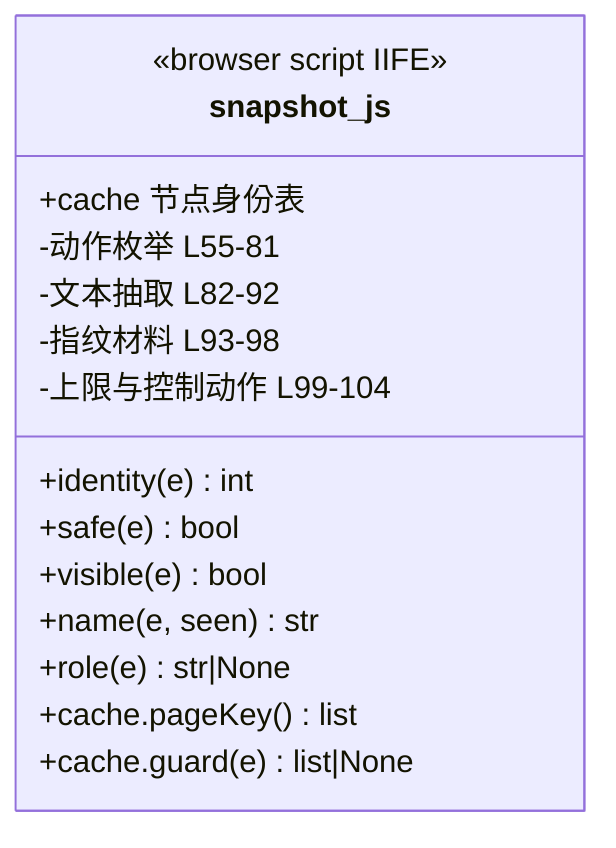

# `snapshot.js` 观察契约职责分析

> 源码位置: `jev_ultrafast/snapshot.js`（第 1-107 行，浏览器端 IIFE，由 `browser.py:13` 读入文本后经 `Runtime.evaluate` 执行）

---

## 📋 **作用**

Agent 的"眼睛"：在**单次求值**内原子产出页面全部可观察状态——控件动作表（带代码所有的节点身份）、可见文本、语义指纹材料（marker/pageKey/guard）。它同时是**安全边界**（密码/文件字段不观察）与**新鲜度契约**（守卫数据的生产者）。

---

## 🏗️ **结构定义**



### 核心内部结构

| 结构 | 位置 | 说明 |
|------|------|------|
| `window.__jevFast = {ids: WeakMap, nodes: Map, next}` | L3 | 节点身份缓存：元素→递增整数，整数→活引用 |
| `identity(e)` | L4-7 | 首见分配 id；`nodes` 保活引用供执行期取回 |
| 断连剪枝 | L8 | 每次快照删除 `!isConnected` 的条目（导航后自然换血） |

---

## 🔍 **核心部分详解**

### 1️⃣ 过滤谓词（第 9-11 行）

```javascript
const safe = e => !['password','file','hidden'].includes(e.type);   // 不观察敏感输入
const visible = e => !e.closest('[aria-hidden="true"],[inert]') &&
  e.checkVisibility({checkOpacity:true,checkVisibilityCSS:true});
```

**设计要点：** 密码值、文件路径、隐藏字段从源头不进入模型上下文（check_guards.py 断言 `never expose this` 不可见）。

### 2️⃣ 可访问名称解析 `name()`（第 12-23 行）

优先级链：`aria-labelledby` 引用（递归，seen 防环）→ `aria-label` → 关联 `<label>` → button/submit/reset 的 value → `alt` → 子文本（跳过 aria-hidden 子树）→ `title` → `placeholder`。

**边界：** 覆盖常见 HTML/ARIA，非完整可访问名称规范（docs/design.md 明示）。

### 3️⃣ 角色判定 `role()`（第 24-43 行）

显式 `role` 属性（限 15 种白名单）优先；否则按标签/类型推导（BUTTON/SUMMARY→button、A→link、SELECT→combobox、TEXTAREA/contenteditable→textbox、INPUT 按 type 细分 checkbox/radio/button/searchbox/spinbutton/textbox）。不识别 → `null` → 不产出动作。

### 4️⃣ 动作枚举（第 55-81 行）

```
对 document.querySelectorAll(selector) 的每个元素：
  ├── safe/visible/:disabled/aria-disabled 过滤
  ├── 几何过滤：宽高>0、中心点在视口内
  ├── gridcell 含内嵌按钮 → 跳过（避免双计）
  ├── base = {node: identity(e), role, label, rect, aria 状态}
  ├── SELECT：每个未选/未禁用 option → {kind:'select', value, label:'字段 → 选项'}
  └── 其余：
        editable（textbox/searchbox/spinbutton，或 INPUT/TEXTAREA 型 combobox 且非只读）
          → {kind:'fill', value} + 追加 {kind:'click', label:'Open xxx'}（先点开日历/下拉）
        否则 → {kind:'click'}
```

**设计要点：** 一个节点可产出多个动作（fill + click），但身份同一——与 `action_space` 的"一节点一索引"呼应。

### 5️⃣ 可见文本抽取（第 82-92 行）

TreeWalker 只取**有几何尺寸且与视口相交**的文本节点，累计 ≤6000 字符——离屏正文/页脚不进模型上下文。

### 6️⃣ 指纹材料（第 44-54, 93-98 行）

| 材料 | 内容 | 消费方 |
|------|------|--------|
| `pageKey()` | timeOrigin/URL/滚动/视口 + 全部安全表单元素的 [id, value, checked, selectedIndex, disabled, readOnly] | click/select 守卫（browser.fresh） |
| `guard(e)` | 目标 [id, role, name, value, checked, selectedIndex, readOnly, disabled, aria 状态, href] + 最近 form/dialog/[role=dialog]/article/li/tr 作用域 innerText ≤6000 | click/select 守卫 |
| `marker` | timeOrigin/URL/滚动/视口/标题/文本/**动作语义（去 rect）**/表单摘要 | 全页新鲜度（fill/scroll/wait/DONE） |
| `fingerprint`（Python 侧） | sha256(url+text+actions+scroll) | act 指纹守门 |

**设计要点：** marker 剔除 rect——**几何永不参与语义指纹**，几何只在输入前即时解析（`snapshot.js:95` 注释原文）。

### 7️⃣ 上限与控制动作（第 99-104 行）

动作截断至 250（`omitted_actions` 记差值，截断者不可被选择）；按滚动位置追加 `scroll_down`(+560)/`scroll_up`(-560)/`wait`。

### 8️⃣ 返回值（第 105-106 行）

`{url, title, w, h, text, scroll, actions, marker, page_key, guards, omitted_actions}`——一次对象往返，无跨调用撕裂。

---

## 🎨 **设计亮点**

1. **身份即安全**：节点 id 由代码分配且指向真实节点；被替换的元素获得新 id，守卫自然失效。
2. **观察即契约**：同一份动作语义既喂模型、又做指纹——"模型看到的"与"守卫保护的"天然一致。
3. **上限内建**：250 动作/6000 字符在浏览器端截断，Python 侧零防御代码。
4. **一次求值**：全部计算在页面内完成，协议往返恒为 1。

---

## 🔗 **与其他模块的协作**

```mermaid
graph LR
    browser_py[browser.py READ_STATE] --> snapshot_js : "evaluate 执行"
    snapshot_js --> model : "actions → action_space"
    snapshot_js --> browser_py : "marker/page_key/guards → fresh"
    snapshot_js --> Agent : "page dict → state"
```

| 协作方 | 关系 | 协作方式 |
|--------|------|---------|
| `browser.py` | 被执行 | READ_STATE（全量）/ MARKER（轻量指纹探针）两处引用 |
| `model.py` | 数据下游 | actions 构建动作空间 |
| `browser_operation` act 分支 | 数据下游 | `nodes.get(id)` 取回真实节点执行 |

---

## 📊 **生命周期**

- **创建时机**: Browser 会话首次 observe 时在页面内初始化 `window.__jevFast`。
- **使用场景**: 每次 observe（全量）；每次 fresh（MARKER/guard 单项）；执行期节点取回。
- **销毁时机**: 页面导航即随文档销毁（下次 observe 重建，身份重新编号——因此导航必然使守卫失效）。
