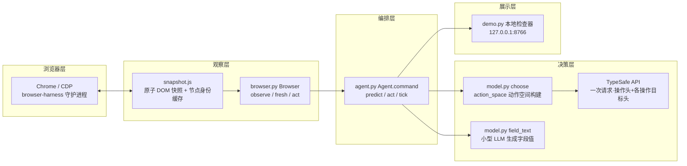
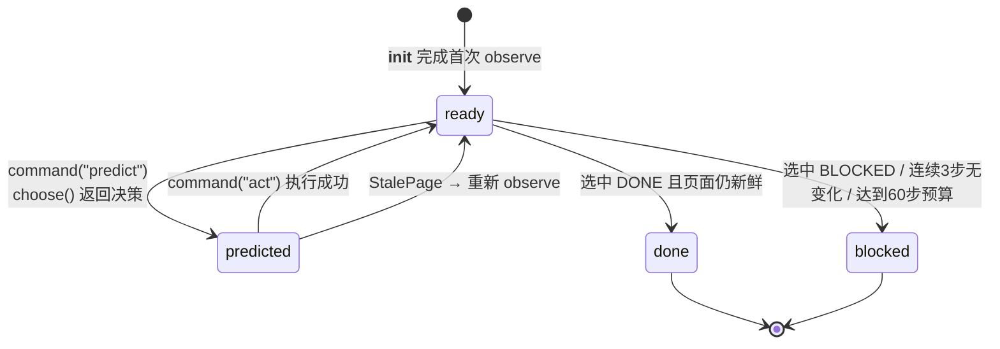
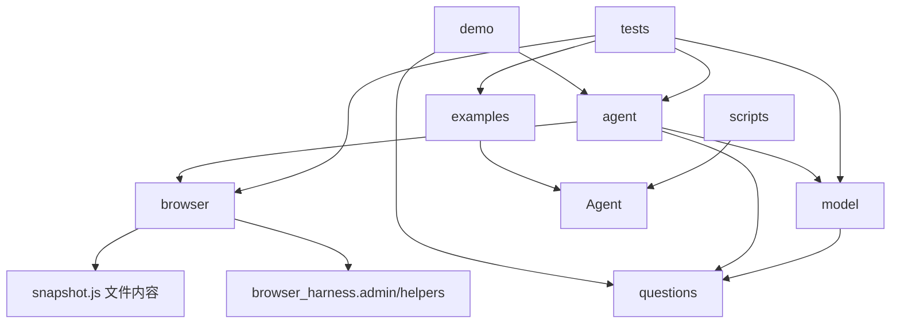

# Jev Ultrafast 架构分析

> 分析日期：2026-09-20 · 版本 0.1.0（MIT 协议）· 来源：browser-use 团队
>
> 一句话定位：**一个"选择而非生成"的浏览器 Agent** —— TypeSafe Jev 模型从动态索引的动作空间中挑选操作与目标，代码（而非模型）拥有执行权；只有 `TYPE_TEXT` 操作才由小型文本 LLM 生成字段值。

## 1. 项目概况

| 项 | 值 |
| --- | --- |
| 语言 | Python ≥ 3.12（核心 ~740 行）+ JavaScript（DOM 快照 107 行 + 检查器前端） |
| 构建工具 | hatchling（pyproject.toml）+ uv（uv.lock） |
| 运行时依赖 | `browser-harness==0.1.13`、`httpx[http2]>=0.28,<1` |
| 开发依赖 | pytest、ruff、pillow |
| 入口点 | 控制台命令 `jev` → `jev_ultrafast.demo:main`（本地检查器） |
| 外部服务 | TypeSafe API（操作/目标选择）、任意 OpenAI 兼容文本 API（字段值生成） |

## 2. 目录结构

```text
jev-ultrafast/
├── jev_ultrafast/            # 核心包（6 个文件，刻意保持"小到可通读"）
│   ├── __init__.py           # 导出 Agent、Browser（6 行）
│   ├── agent.py              # 完整 agent loop + 文本助手交接（174 行）
│   ├── browser.py            # 浏览器连接、即时几何解析、执行（194 行）
│   ├── model.py              # 动态操作/目标多头 + 文本生成（198 行）
│   ├── questions.py          # 模型指令提示词 + MAX_STEPS=60（26 行）
│   ├── snapshot.js           # 原子 DOM 快照、索引控件、新鲜度守卫（107 行）
│   └── static/               # 本地检查器前端（index.html / app.js / style.css / fixture.html）
├── examples/
│   ├── flights.py            # 真实 Google Flights 演示 + 独立结果校验
│   └── run.py                # 通用 --url/--goal 运行器
├── scripts/                  # 守卫检查 / 冒烟 / 测量 / 录制 / 渲染（离线与付费脚本分离）
├── tests/test_agent.py       # 离线契约测试（320 行，不调用付费 API）
├── docs/                     # design.md、performance.md、测量 JSON、演示媒体
└── out/                      # 本分析报告输出目录（非项目原有）
```

## 3. 架构模式

脚本自动识别为"自定义/未识别"，因为这是一个**刻意的极简分层管道**，不套用通用框架模式。人工分析归纳如下：

### 3.1 分层结构（page → indexed elements → operation + target → execution）



### 3.2 关键设计决策

| 模式 | 实现 | 位置 |
| --- | --- | --- |
| **动态动作空间（Dynamic Action Space）** | 每次观察为每个可见 DOM 节点分配一个索引；动作候选随页面变化而重建，无站点特定计划 | `model.py:48-78` `action_space()` |
| **投机性多头（Speculative Fan-out）** | 一次 TypeSafe 请求同时回答"选哪个操作"和"每种操作各自的最佳目标"；只有被选中操作的目标头会被消费，其余头无效不影响执行 | `model.py:94-130` |
| **代码拥有执行权** | 模型只输出有限选择的 id；节点引用来自 `snapshot.js` 的 WeakMap 身份缓存，绝不来自模型生成的选择器/坐标/代码 | `browser.py:141-160` |
| **单命令状态机** | `Agent.command()` 用 `predict`/`act`/`tick` 三个命令与 `ready/predicted/done/blocked` 状态驱动整个循环，状态集中在一个 dict | `agent.py:52-161` |
| **写前日志（Log-before-observe）** | 动作先写入 history，再观察结果；导航中断观察也不丢失已执行动作 | `agent.py:120-141` |
| **语义指纹 + 双层守卫** | 全页 `marker`（URL/文本/动作语义）用于一般新鲜度；点击/选择另用 `page_key`（表单值）+ `guards`（目标及邻近上下文）做动作级校验 | `snapshot.js:44-54`、`browser.py:88-98` |
| **消费即失效（Consume-once）** | 决策在执行前一次性置空，重试不可能双击 | `agent.py:90-91` |
| **文本缓存按输入整体匹配** | `pending_text` 仅在其完整 helper 输入（goal/field/page/history）完全一致时复用 | `agent.py:109-115` |
| **回环专用检查器** | HTTP 服务仅绑 127.0.0.1，Host/Origin/随机 Token 三重校验，非阻塞锁串行化步骤 | `demo.py:104-125` |

### 3.3 状态机



## 4. 依赖分析

### 4.1 运行时依赖（pyproject.toml）

| 依赖 | 用途 | 备注 |
| --- | --- | --- |
| `browser-harness==0.1.13` | CDP WebSocket 守护进程与 `cdp()` 调用、`ensure_daemon()` | 间接依赖 cdp-use、fetch-use、pillow、websockets，全部为纯 Python wheel |
| `httpx[http2]>=0.28,<1` | 调用 TypeSafe 与文本模型的 HTTP 客户端（HTTP/2、25s 超时） | `model.py:12` 模块级全局客户端 |

版本锁定 `browser-harness==0.1.13` 为精确版本约束，保证 CDP 交互行为可复现。

### 4.2 模块内部依赖（import 关系）



特点：**单向无环**。`questions.py` 是纯常量叶子；`browser.py` 不 import `model.py`（观察与执行完全不懂模型）；`agent.py` 是唯一编排者。标准库使用极简（json/pathlib/time/hashlib/base64/argparse 等），无 ORM、无重型框架。

### 4.3 外部服务契约

| 服务 | 端点 | 调用点 | 失败策略 |
| --- | --- | --- | --- |
| TypeSafe | `https://api.typesafe.ai/v1/systemone`（模型默认 `jev-latest`，可用 `TYPESAFE_MODEL` 覆盖） | `model.py:119` `choose()` | 429/529/503 指数退避重试 3 次；其他错误/网络失败立即抛错，**不执行任何动作** |
| 文本助手 | `${TEXT_MODEL_BASE_URL}/chat/completions`（默认 DeepSeek，示例配置 OpenRouter Mercury） | `model.py:170-186` `field_text()` | 同上重试；输出必须是恰好 `{"text": str}` 且 ≤2000 字符，否则拒绝输入 |

## 5. 安全设计要点

- 模型输出永远不成为选择器、坐标、shell 命令或可执行 JS（`README.md`、`browser.py:143`）。
- 密码/文件/隐藏输入不进入快照（`snapshot.js:9`）；凭据留在服务端 `.env`（已被 .gitignore）。
- 检查器仅监听回环地址，校验 Host 头、Origin 与 32 字节随机 Token（`demo.py:104-110`）。
- 提示词将页面文本声明为不可信数据而非指令（`questions.py` NEXT_ACTION/TEXT_VALUE）。
- 预算约束：60 个浏览器动作、120 次决策请求（`questions.py:26`、`agent.py:75-76`）。

## 6. 已知边界（来自 docs/design.md）

- 不支持 Shadow DOM、iframe、canvas、文件上传、弹出标签页、嵌套滚动、任意键盘组件。
- 可访问名称解析覆盖常见标签/ARIA，不是完整规范实现。
- 拥有的标签页共享现有 Chrome 配置文件。
- 两个网站的成功不代表普遍可靠性；`DONE` 必须独立校验。

## 7. 质量保障结构

| 层 | 文件 | 性质 |
| --- | --- | --- |
| 离线单元/契约测试 | `tests/test_agent.py`（16+ 用例） | 免费，pytest 默认执行 |
| 本地浏览器守卫回归 | `scripts/check_guards.py` | 真实浏览器、零模型调用 |
| 付费冒烟 | `scripts/smoke.py`、`examples/flights.py` | 真实 API，显式手动运行 |
| 测量与录制 | `scripts/measure_flights.py`、`record_flights.py`、`render_demo.py` | 生成 docs/ 证据 |

AGENTS.md 的检查命令：`uv run ruff check .`、`uv run pytest`、`node --check jev_ultrafast/static/app.js`、`uv build`。
