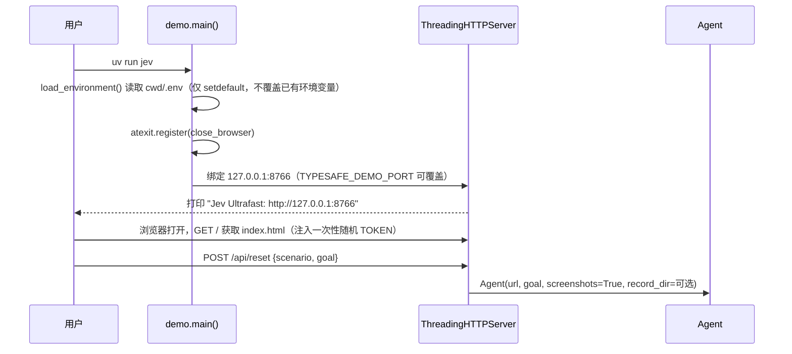
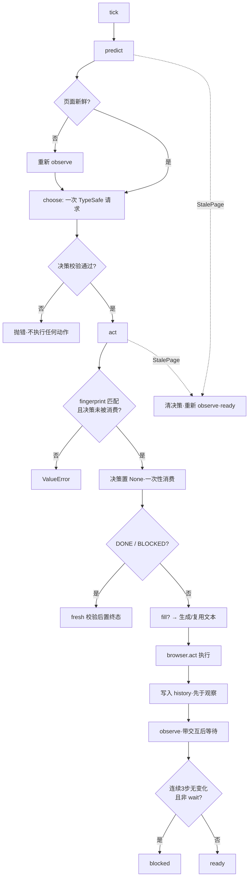

# Jev Ultrafast 运行机制分析

> 入口点：控制台命令 `jev` → `jev_ultrafast/demo.py:main`（检查器）；库入口 `jev_ultrafast.Agent`（编程使用）。
> 本文档基于 `agent.py`、`browser.py`、`model.py`、`snapshot.js`、`questions.py` 的逐行阅读，行号可直接定位。

## 1. 启动与初始化流程

### 1.1 检查器启动（`uv run jev`）

`demo.py:44-67` 的 `command("reset")` 支持三种场景：`flights`（真实 Google Flights）、`travel`/`research`（本地 `fixture.html` 夹具）。所有 POST 需携带 `X-Demo-Token` 头且 Host/Origin 匹配回环源；`LOCK.acquire(blocking=False)` 失败返回 409，保证同一时刻只有一个浏览器步骤在跑。

### 1.2 Agent 构造（`agent.py:13-44`）

1. 目标文本规整（字符串或列表均可），空目标抛 `ValueError`。
2. `Browser(url)`：`ensure_daemon()` 启动/连接 Browser Harness 守护进程 → `Target.createTarget`（后台标签页，about:blank）→ attach 取 sessionId → 视口固定 **1120×780** → **开启焦点仿真**（`Emulation.setFocusEmulationEnabled`，让后台标签页的 rAF/动画不被节流，且不切换用户可见标签页）→ `Page.navigate` 轮询 `document.readyState`（最长 15s，20ms 间隔）。
3. 首次 `observe()`；异常时关闭浏览器再抛出（不留孤儿标签页）。
4. 初始化集中式 state dict（goal/page/decision/history/status/decisions/text_calls/elapsed_ms…），`record_dir` 存在时把首屏截图写为 `000000.jpg`。

## 2. 核心循环：tick = predict + act

`agent.py:163-165` 的 `run()` 是生成器：`while status not in {"done","blocked"}: yield command("tick")`。每个 tick 内部（`agent.py:55-64`）：

### 2.1 predict（`agent.py:65-85`）

- 首次调用时启动 `perf_counter` 计时钟（`elapsed_ms` 由此而来）。
- 预算：决策请求总数上限 `MAX_STEPS * 2 = 120`。
- `fresh()` 不通过则先重新观察再决策。
- `choose()` 返回的决策连同 fingerprint 与耗时记入 `decisions`。

### 2.2 act（`agent.py:86-158`）

关键顺序（与 AGENTS.md 的不变量一一对应）：

1. **守门**：请求携带的 fingerprint 必须等于当前页面 fingerprint；否则拒绝。
2. **消费即失效**：`state["decision"] = None` 在任何变更/模型调用之前执行——重试不可能双击。
3. **DONE/BLOCKED**：仍需 `fresh(page)`；页面已变则抛 `StalePage` 要求重新决策（防止基于旧页面宣告完成）。
4. **TYPE_TEXT 文本生成**：先 `fresh`，再构造 `field_context`（goal + 字段 label/role/value + 页面 title/前 6000 字符文本 + 最近 6 条动作）。`pending_text` 缓存仅在**整个 context 完全相等**时复用（`agent.py:110-114`）；成功输入后清空（`agent.py:118`）。
5. **执行**：`browser.act(action, page, text)`（内部再次 `fresh`，含文本生成耗时后的页面变化）。
6. **写前日志**：执行结果写入 `history` 后才 `observe()`；若观察遇导航抛 `StalePage`，已执行动作仍留在 history（`agent.py:120-141`，测试 `test_stale_observation_preserves_executed_action` 固定该行为）。
7. **无进展检测**：最近 3 条历史均为 `page_changed=False` 且 `kind != "wait"` → `blocked`（`agent.py:153-158`）。

### 2.3 StalePage 恢复（tick 内，`agent.py:57-64`）

预测或执行抛 `StalePage` 时：清决策 → 状态回 `ready` → 重新观察 → 返回快照。**任何浏览器变更绝不重试**；中断的原生下拉框执行抛 `RuntimeError`（变更事件可能已触发，重试有风险），要求人工检查。

## 3. 观察机制：一次原子读取

### 3.1 snapshot.js（在浏览器内执行一次 `Runtime.evaluate`）

- **节点身份**：`window.__jevFast = {ids: WeakMap, nodes: Map, next}` 给每个真实 DOM 节点分配递增整数 id；每次快照剪除断连节点（`snapshot.js:3-8`）。这不是 CDP backendNodeId，是页面级自建身份。
- **可见控件枚举**：选择器覆盖 `a[href]/button/input/textarea/select/summary/[contenteditable]` + 15 种 ARIA role；过滤 `password/file/hidden`、`:disabled`、`aria-disabled`、`aria-hidden`、`inert`、`checkVisibility` 不通过、零尺寸、视口外（`snapshot.js:24-59`）。
- **名称解析**（`snapshot.js:12-23`）：`aria-labelledby` 引用 → `aria-label` → `<label>` 关联 → button value → `alt` → 子文本 → `title` → `placeholder`。
- **动作生成**（`snapshot.js:60-80`）：
  - `<select>` 的每个未选/未禁用 option 生成一条 `kind:'select'` 动作（label 为 `字段名 → 选项名`）；
  - 可编辑元素（textbox/searchbox/spinbutton，或 INPUT/TEXTAREA 型 combobox 且非只读）生成 `kind:'fill'` + 附带 `kind:'click'`（"Open xxx"，用于先点开日历/下拉）；
  - 其余为 `kind:'click'`。
- **可见文本**：TreeWalker 遍历文本节点，只保留有几何尺寸且与视口相交者，截断 6000 字符（`snapshot.js:82-92`）——离屏正文/页脚不进模型上下文。
- **新鲜度材料**：`marker`（时间源/URL/滚动/视口/标题/文本/动作语义）、`page_key`（全部安全表单元素的值/选中态）、每动作 `guards`（目标自身属性 + 最近 form/dialog/row 作用域 6000 字符文本）（`snapshot.js:44-54, 93-98`）。
- **上限**：动作截断到 250 条（截断的不可被选择，`omitted_actions` 记录数量）；追加 `scroll_down`（+560px）/`scroll_up`/`wait` 三个控制动作。

### 3.2 Python 侧（`browser.py:44-86, 115-194`）

- `observe()`：单次 `Runtime.evaluate` 执行整个 snapshot.js —— **一次浏览器调用完成读取**（测试 `test_observation_is_one_atomic_browser_read` 断言 `cdp.call_count == 1`）。失败重试最多 10 次（20ms 间隔）。
- `fingerprint()`：sha256(url + text + actions + scroll)；截图变化不影响指纹（测试覆盖）。
- **交互后等待**（`browser.py:45-76`）：上一次非 wait 输入后，下一次 observe 先等待——combobox fill 最多 200ms 等 `role="option"` 的建议可见；其他交互最多 2 个 rAF 或 50ms。该读取发生在"执行已记录"之后，导航中断它也不影响已记动作。

## 4. 决策机制：一次请求，多个问题头

### 4.1 动作空间构建（`model.py:48-78`）

每个 DOM 节点一个索引 `[1] [2] ...`；同一节点可支持多个操作（如一个 combobox 同时出现在 `TYPE_TEXT` 和 `CLICK` 目标头里，索引相同）。SELECT 目标为复合索引 `"index:option"`。控制动作（WAIT/SCROLL_UP/SCROLL_DOWN）与 DONE/BLOCKED 只出现在 operation 头的候选里。

### 4.2 choose() 的请求体（`model.py:81-148`）

一次 POST 到 TypeSafe `/v1/systemone`，`questions` 包含：

- `operation`：候选 = 各目标头非空的操作 + 控制动作 + DONE + BLOCKED，各带说明；
- `<operation>_target`（如 `click_target`、`type_text_target`、`select_target`）：候选仅含该操作兼容的元素，附当前值/checked/selected/expanded 状态；指令含 goal + 操作名 + NEXT_ACTION 与 TARGET 规则（目标头不知道操作答案，题目里显式假设"如果是该操作"）。

`state` 含页面 url/title/可见文本、元素表、最近 10 条动作摘要。

### 4.3 响应校验（`model.py:30-45` `validate_choice`）

被选 id 必须在候选集合内；概率覆盖全部候选且均为有限 [0,1]；总和 ≈1（±0.02）；被选项必须是最大概率。**只校验被选中操作对应的目标头**——投机头的无效答案不可能变成动作（测试 `test_click_cannot_consume_a_text_target` 固定）。

### 4.4 文本生成（`model.py:151-198` `field_text`）

- 无 `TEXT_MODEL_API_KEY` 直接抛错，绝不硬编码或猜测值。
- 请求 OpenAI 兼容 `/chat/completions`，`response_format=json_object`，按 base URL 启发式配置 reasoning（DeepSeek 用 `thinking.disabled`，其余 `effort:low`；`TEXT_MODEL_REASONING=none` 强制关闭）。
- 输出必须解析为恰好 `{"text": str}`，非空、≤2000 字符；`null`（缺值）与任何多余键都被拒绝——"nothing typed"。

## 5. 执行机制（`browser.py:100-107, 135-186`）

1. **执行前守卫**：`fresh(page, action)`；click/select 比对 `page_key + guard(node)`（表单值 + 目标属性 + 邻近上下文）。
2. **即时几何与命中测试**（浏览器内执行）：重新 `getBoundingClientRect` 取中心点 → 校验在视口内 → `elementFromPoint` 确认未被覆盖 → disabled/readonly/visibility 再查一遍。任一失败：select 抛 RuntimeError、其余抛 StalePage。动画移动的目标点击**当前**位置，不触发重新预测。
3. **输入事件**：click 走 CDP `Input.dispatchMouseEvent`（pressed+released）；fill 先发 Cmd/Ctrl+A（`sys.platform=="darwin"` ? 4 : 2 —— 平台自适应）再 `Input.insertText`；select 直接设值并派发 `input`+`change`；scroll 走 `mouseWheel`（固定 550,650）；wait 睡 100ms。
4. **变更永不重试**；中断的 select 因 change 事件可能已触发而停止。

## 6. 事件处理与并发模型

- 无事件总线/中间件；并发仅两处：检查器的 `ThreadingHTTPServer` + `threading.Lock`（非阻塞获取，忙时 409）；`record_flights.py` 用 `threading` 做 CDP screencast 录制。其余全部同步串行。
- 计时统一 `time.perf_counter()`；`elapsed_ms` 在 predict/act/observe 各节点更新。

## 7. 可观测产物

| 产物 | 内容 | 位置 |
| --- | --- | --- |
| `state["history"]` | 每步动作/操作/目标/概率/置信度/双模型延迟/usage/page_changed/url/双时刻戳 | `agent.py:121-141` |
| `state["decisions"]` | 每次决策全量记录（含 raw_answers/request body） | `agent.py:78-84` |
| `state["text_calls"]` | 每次真实文本生成（字段/值/模型/延迟） | `agent.py:115` |
| record_dir 截图 | 每步 `elapsed_ms.jpg` | `agent.py:149-152` |
| examples/flights.py | `state.json` + `session.json` + 独立 verify 结果 | `examples/flights.py:53-59` |

## 8. 实测性能证据（docs/performance.md）

- Google Flights 苏黎世→伦敦全程 **7.073s**（1× 速度视频，含文本生成、模型调用、加载等待）；录制含 17 次 Jev 请求、10 次交互 + 1 次 WAIT、2 次文本助手调用，Jev 中位延迟 178ms。
- 三对交替对比：中位任务时间 9.450s → 7.092s（-25%），中位浏览器协议调用 1,092 → **101**（一次原子读取取代反复无障碍树扫描是主因），TypeSafe 请求 22 → 17。
- 其他任务：维基百科打开哥德尔不完备定理 2.798s；本地酒店夹具搜索+过滤 1.896s（均有独立校验）。
